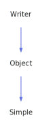

<h1>GraphNode</h1>

<a href="https://github.com/CharlesCarley/MdDox.md">~</a>
<a href="indexpage.md#mddox">MdDox</a>
/
<a href="index.md#index">Index</a>
/
<a href="namespaceMdDox.md#mddox">MdDox</a>
::
<b>GraphNode</b>
 
 

<h4>Derived From</h4>

<a href="classMdDox_1_1Xml_1_1Node.md#mddoxxmlnode">MdDox::Xml::Node</a>

 

<h2>Public Methods</h2>
<a href="#graphnode" class="icon-list-item">GraphNode
</a>

 
<a href="#graphnode" class="icon-list-item">GraphNode
</a>

 

<h4>Defined in</h4>
<a href="https://github.com/CharlesCarley/MdDox/blob/master//Source/MdDoxTree/GraphWriter.cpp#L34" class="icon-list-item">GraphWriter.cpp
</a>

 

<h2>GraphNode</h2>
<b>GraphNode</b>
<i>(</i>
<i>)</i>

<h4>References</h4>
<a href="classMdDox_1_1Xml_1_1Node.md#_autodelete" class="icon-list-item">_autoDelete
</a>

 

<h4>Defined in</h4>
<a href="https://github.com/CharlesCarley/MdDox/blob/master//Source/MdDoxTree/GraphWriter.cpp#L36" class="icon-list-item">GraphWriter.cpp
</a>

 
 

<h2>GraphNode</h2>
<b>GraphNode</b>
<i>(</i>

const 
<a href="namespaceMdDox.md#string">String</a>
 &amp;
name

<i>)</i>

<h4>References</h4>
<a href="classMdDox_1_1Xml_1_1Node.md#_autodelete" class="icon-list-item">_autoDelete
</a>

 

<h4>Defined in</h4>
<a href="https://github.com/CharlesCarley/MdDox/blob/master//Source/MdDoxTree/GraphWriter.cpp#L42" class="icon-list-item">GraphWriter.cpp
</a>

 
 

</body>
</html>
