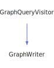

<h1>IndexPageFilter</h1>

<a href="https://github.com/CharlesCarley/MdDox#~">~</a>
<a href="indexpage.md#mddox">MdDox</a>
/
<a href="index.md#index">Index</a>
/
<a href="namespaceMdDox.md#mddox">MdDox</a>
::
<b>IndexPageFilter</b>
 
 

<h4>Derived From</h4>

<a href="classMdDox_1_1Doxygen_1_1Visitors_1_1DoxygenIndexQueryVisitor.md#doxygenindexqueryvisitor">MdDox::Doxygen::Visitors::DoxygenIndexQueryVisitor</a>

 

<h2>Public Members</h2>
<a href="#classes" class="icon-list-item">classes
</a>

 
<a href="#directories" class="icon-list-item">directories
</a>

 
<a href="#dirpaths" class="icon-list-item">dirPaths
</a>

 
<a href="#namespaces" class="icon-list-item">namespaces
</a>

 
<a href="#pages" class="icon-list-item">pages
</a>

 

<h2>Public Methods</h2>
<a href="#visitedcompound" class="icon-list-item">visitedCompound
</a>

 

<h4>Defined in</h4>
<a href="https://github.com/CharlesCarley/MdDox/blob/master/Source/MdDoxTree/IndexPageWriter.cpp#L43" class="icon-list-item">IndexPageWriter.cpp
</a>

 
 
<blockquote>
<a href="#indexpagefilter" class="icon-list-item">top
</a>

</blockquote>

<h2>classes</h2>
<a href="namespaceMdDox.md#referencelist">ReferenceList</a>
<b>classes</b>
 

<h4>Defined in</h4>
<a href="https://github.com/CharlesCarley/MdDox/blob/master/Source/MdDoxTree/IndexPageWriter.cpp#L46" class="icon-list-item">IndexPageWriter.cpp
</a>

 
 
<blockquote>
<a href="#indexpagefilter" class="icon-list-item">top
</a>

</blockquote>
 

<h2>directories</h2>
<a href="namespaceMdDox.md#referencelist">ReferenceList</a>
<b>directories</b>
 

<h4>Defined in</h4>
<a href="https://github.com/CharlesCarley/MdDox/blob/master/Source/MdDoxTree/IndexPageWriter.cpp#L48" class="icon-list-item">IndexPageWriter.cpp
</a>

 
 
<blockquote>
<a href="#indexpagefilter" class="icon-list-item">top
</a>

</blockquote>
 

<h2>dirPaths</h2>
<a href="namespaceMdDox.md#referencelist">ReferenceList</a>
<b>dirPaths</b>
 

<h4>Defined in</h4>
<a href="https://github.com/CharlesCarley/MdDox/blob/master/Source/MdDoxTree/IndexPageWriter.cpp#L49" class="icon-list-item">IndexPageWriter.cpp
</a>

 
 
<blockquote>
<a href="#indexpagefilter" class="icon-list-item">top
</a>

</blockquote>
 

<h2>namespaces</h2>
<a href="namespaceMdDox.md#referencelist">ReferenceList</a>
<b>namespaces</b>
 

<h4>Defined in</h4>
<a href="https://github.com/CharlesCarley/MdDox/blob/master/Source/MdDoxTree/IndexPageWriter.cpp#L47" class="icon-list-item">IndexPageWriter.cpp
</a>

 
 
<blockquote>
<a href="#indexpagefilter" class="icon-list-item">top
</a>

</blockquote>
 

<h2>pages</h2>
<a href="namespaceMdDox.md#referencelist">ReferenceList</a>
<b>pages</b>
 

<h4>Defined in</h4>
<a href="https://github.com/CharlesCarley/MdDox/blob/master/Source/MdDoxTree/IndexPageWriter.cpp#L45" class="icon-list-item">IndexPageWriter.cpp
</a>

 
 
<blockquote>
<a href="#indexpagefilter" class="icon-list-item">top
</a>

</blockquote>
 

<h2>visitedCompound</h2>
void
<b>visitedCompound</b>
<i>(</i>

const 
<a href="classMdDox_1_1Doxygen_1_1CompoundIndexQuery.md#compoundindexquery">Doxygen::CompoundIndexQuery</a>
 &amp;
query

<i>)</i>

<h4>Details</h4>
Called when the element 
<b>compound</b>
 is found. 
 
 
<ul>
<li><b>query</b>
 - 
Const reference to the CompoundIndexQuery class. 
</li>
</ul>
 

<h4>References</h4>

<a href="classMdDox_1_1Reference.md#setname">setName</a>

<a href="classMdDox_1_1Doxygen_1_1CompoundIndexQuery.md#getname">getName</a>

<a href="classMdDox_1_1Reference.md#setid">setId</a>

<a href="classMdDox_1_1Doxygen_1_1CompoundIndexQuery.md#getrefid">getRefId</a>

<a href="classMdDox_1_1Doxygen_1_1CompoundIndexQuery.md#getkind">getKind</a>

<a href="namespaceMdDox_1_1Doxygen.md#dck_group">DCK_GROUP</a>

<a href="namespaceMdDox_1_1Doxygen.md#dck_example">DCK_EXAMPLE</a>

<a href="namespaceMdDox_1_1Doxygen.md#dck_page">DCK_PAGE</a>

<a href="classMdDox_1_1IndexPageFilter.md#pages">pages</a>

<a href="namespaceMdDox_1_1Doxygen.md#dck_module">DCK_MODULE</a>

<a href="namespaceMdDox_1_1Doxygen.md#dck_namespace">DCK_NAMESPACE</a>

<a href="classMdDox_1_1IndexPageFilter.md#namespaces">namespaces</a>

<a href="namespaceMdDox_1_1Doxygen.md#dck_struct">DCK_STRUCT</a>

<a href="namespaceMdDox_1_1Doxygen.md#dck_union">DCK_UNION</a>

<a href="namespaceMdDox_1_1Doxygen.md#dck_class">DCK_CLASS</a>

<a href="classMdDox_1_1IndexPageFilter.md#classes">classes</a>

<a href="namespaceMdDox_1_1Doxygen.md#dck_dir">DCK_DIR</a>

<a href="classMdDox_1_1Reference.md#getname">getName</a>

<a href="classMdDox_1_1StringUtils.md#split">split</a>

<a href="classMdDox_1_1IndexPageFilter.md#dirpaths">dirPaths</a>

<a href="classMdDox_1_1IndexPageFilter.md#directories">directories</a>

<a href="namespaceMdDox_1_1Doxygen.md#dck_interface">DCK_INTERFACE</a>

<a href="namespaceMdDox_1_1Doxygen.md#dck_service">DCK_SERVICE</a>

<a href="namespaceMdDox_1_1Doxygen.md#dck_protocol">DCK_PROTOCOL</a>

<a href="namespaceMdDox_1_1Doxygen.md#dck_category">DCK_CATEGORY</a>

<a href="namespaceMdDox_1_1Doxygen.md#dck_exception">DCK_EXCEPTION</a>

<a href="namespaceMdDox_1_1Doxygen.md#dck_singleton">DCK_SINGLETON</a>

<a href="namespaceMdDox_1_1Doxygen.md#dck_type">DCK_TYPE</a>

<a href="namespaceMdDox_1_1Doxygen.md#dck_file">DCK_FILE</a>

<a href="namespaceMdDox_1_1Doxygen.md#dck_invalid">DCK_INVALID</a>

<a href="classMdDox_1_1SiteBuilder.md#get">get</a>

<a href="classMdDox_1_1SiteBuilder.md#insertcompound">insertCompound</a>

<a href="classMdDox_1_1Doxygen_1_1CompoundIndexQuery.md#foreachmember">foreachMember</a>

<a href="classMdDox_1_1SiteBuilder.md#insertmember">insertMember</a>

<a href="classMdDox_1_1Doxygen_1_1MemberIndexQuery.md#getkind">getKind</a>

<a href="classMdDox_1_1Doxygen_1_1MemberIndexQuery.md#getname">getName</a>

<a href="classMdDox_1_1Doxygen_1_1MemberIndexQuery.md#getrefid">getRefId</a>

<h4>Defined in</h4>
<a href="https://github.com/CharlesCarley/MdDox/blob/master/Source/MdDoxTree/IndexPageWriter.cpp#L52" class="icon-list-item">IndexPageWriter.cpp
</a>

 
 
<blockquote>
<a href="#indexpagefilter" class="icon-list-item">top
</a>

</blockquote>
 
 
<blockquote>
The following sources were used to generate this page.
 
<a href="../xml/classMdDox_1_1IndexPageFilter.xml#L1" class="icon-list-item">classMdDox_1_1IndexPageFilter.xml
</a>

 
<a href="../xml/compound.xsd#L1" class="icon-list-item">compound.xsd
</a>

</blockquote>

</body>
</html>
