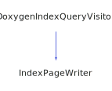

<h1>IndexPageWriter</h1>

<a href="https://github.com/CharlesCarley/MdDox">~</a>
<a href="indexpage.md#mddox">MdDox</a>
/
<a href="index.md#index">Index</a>
/
<a href="namespaceMdDox.md#mddox">MdDox</a>
::
<b>IndexPageWriter</b>
 
 

<h4>Derived From</h4>

<a href="classMdDox_1_1Doxygen_1_1Visitors_1_1DoxygenIndexQueryVisitor.md#mddoxdoxygenvisitorsdoxygenindexqueryvisitor">MdDox::Doxygen::Visitors::DoxygenIndexQueryVisitor</a>

 

<h2>Private Members</h2>
<a href="#_indexdir" class="icon-list-item">_indexDir
</a>

 
<a href="#_outdir" class="icon-list-item">_outDir
</a>

 
<a href="#_stream" class="icon-list-item">_stream
</a>

 
<a href="#_writer" class="icon-list-item">_writer
</a>

 

<h2>Private Methods</h2>
<a href="#dispatchfilter" class="icon-list-item">dispatchFilter
</a>

 
<a href="#makefilename" class="icon-list-item">makeFilename
</a>

 
<a href="#writereferencefile" class="icon-list-item">writeReferenceFile
</a>

 

<h2>Public Methods</h2>
<a href="#indexpagewriter" class="icon-list-item">IndexPageWriter
</a>

 
<a href="#exec" class="icon-list-item">exec
</a>

 

<h4>Defined in</h4>
<a href="https://github.com/CharlesCarley/MdDox/blob/master/Source/MdDoxTree/IndexPageWriter.h#L35" class="icon-list-item">IndexPageWriter.h
</a>

<h2>_indexDir</h2>
<a href="namespaceMdDox.md#string">String</a>
<b>_indexDir</b>
 

<h4>Defined in</h4>
<a href="https://github.com/CharlesCarley/MdDox/blob/master/Source/MdDoxTree/IndexPageWriter.h#L39" class="icon-list-item">IndexPageWriter.h
</a>

 

<h2>_outDir</h2>
<a href="classMdDox_1_1PathUtil.md#pathutil">PathUtil</a>
<b>_outDir</b>
 

<h4>Defined in</h4>
<a href="https://github.com/CharlesCarley/MdDox/blob/master/Source/MdDoxTree/IndexPageWriter.h#L40" class="icon-list-item">IndexPageWriter.h
</a>

 

<h2>_stream</h2>
<a href="namespaceMdDox.md#outputfilestream">OutputFileStream</a>
 *
<b>_stream</b>
 

<h4>Defined in</h4>
<a href="https://github.com/CharlesCarley/MdDox/blob/master/Source/MdDoxTree/IndexPageWriter.h#L37" class="icon-list-item">IndexPageWriter.h
</a>

 

<h2>_writer</h2>
<a href="classMdDox_1_1DocumentWriter.md#documentwriter">DocumentWriter</a>
 *
<b>_writer</b>
 

<h4>Defined in</h4>
<a href="https://github.com/CharlesCarley/MdDox/blob/master/Source/MdDoxTree/IndexPageWriter.h#L38" class="icon-list-item">IndexPageWriter.h
</a>

 

<h2>dispatchFilter</h2>
void
<b>dispatchFilter</b>
<i>(</i>

const 
<a href="classMdDox_1_1IndexPageFilter.md#indexpagefilter">IndexPageFilter</a>
 &amp;
filter

<i>)</i>

<h4>Defined in</h4>
<a href="https://github.com/CharlesCarley/MdDox/blob/master/Source/MdDoxTree/IndexPageWriter.h#L42" class="icon-list-item">IndexPageWriter.h
</a>

 
<a href="https://github.com/CharlesCarley/MdDox/blob/master/Source/MdDoxTree/IndexPageWriter.cpp#L146" class="icon-list-item">IndexPageWriter.cpp
</a>

 

<h2>makeFilename</h2>
<a href="namespaceMdDox.md#string">String</a>
<b>makeFilename</b>
<i>(</i>

const 
<a href="classMdDox_1_1Reference.md#reference">Reference</a>
 &amp;
ref

<i>)</i>

<h4>Defined in</h4>
<a href="https://github.com/CharlesCarley/MdDox/blob/master/Source/MdDoxTree/IndexPageWriter.h#L44" class="icon-list-item">IndexPageWriter.h
</a>

 
<a href="https://github.com/CharlesCarley/MdDox/blob/master/Source/MdDoxTree/IndexPageWriter.cpp#L158" class="icon-list-item">IndexPageWriter.cpp
</a>

 

<h2>writeReferenceFile</h2>
void
<b>writeReferenceFile</b>
<i>(</i>

const 
<a href="namespaceMdDox.md#string">String</a>
 &amp;
name

<a href="namespaceMdDox.md#iconid">IconId</a>
icon

const 
<a href="namespaceMdDox.md#string">String</a>
 &amp;
heading

const 
<a href="namespaceMdDox.md#referencelist">ReferenceList</a>
 &amp;
list

<i>)</i>

<h4>Defined in</h4>
<a href="https://github.com/CharlesCarley/MdDox/blob/master/Source/MdDoxTree/IndexPageWriter.h#L46" class="icon-list-item">IndexPageWriter.h
</a>

 
<a href="https://github.com/CharlesCarley/MdDox/blob/master/Source/MdDoxTree/IndexPageWriter.cpp#L165" class="icon-list-item">IndexPageWriter.cpp
</a>

 

<h2>IndexPageWriter</h2>
<b>IndexPageWriter</b>
<i>(</i>

<a href="classMdDox_1_1DocumentWriter.md#documentwriter">DocumentWriter</a>
 *
writer

<a href="namespaceMdDox.md#string">String</a>
indexDir

<i>)</i>

<h4>Defined in</h4>
<a href="https://github.com/CharlesCarley/MdDox/blob/master/Source/MdDoxTree/IndexPageWriter.h#L52" class="icon-list-item">IndexPageWriter.h
</a>

 
<a href="https://github.com/CharlesCarley/MdDox/blob/master/Source/MdDoxTree/IndexPageWriter.cpp#L116" class="icon-list-item">IndexPageWriter.cpp
</a>

 

<h2>exec</h2>
void
<b>exec</b>
<i>(</i>

const 
<a href="classMdDox_1_1Doxygen_1_1DoxygenIndexQuery.md#doxygendoxygenindexquery">Doxygen::DoxygenIndexQuery</a>
 &amp;
query

const 
<a href="classMdDox_1_1PathUtil.md#pathutil">PathUtil</a>
 &amp;
outDir

<i>)</i>

<h4>References</h4>

<a href="classMdDox_1_1SiteBuilder.md#get">get</a>

<a href="classMdDox_1_1PathUtil.md#filename">fileName</a>

<a href="namespaceMdDox.md#stringcombine">StringCombine</a>

<a href="classMdDox_1_1SiteBuilder.md#outputfileext">outputFileExt</a>

<a href="classMdDox_1_1PathUtil.md#fullpath">fullPath</a>

<a href="classMdDox_1_1Doxygen_1_1DoxygenIndexQuery.md#visit">visit</a>

<a href="classMdDox_1_1SiteBuilder.md#getcompoundname">getCompoundName</a>

<a href="classMdDox_1_1SiteBuilder.md#projecttitle">projectTitle</a>

<a href="namespaceMdDox.md#writegenerictitlebar">writeGenericTitleBar</a>

<a href="classMdDox_1_1SiteBuilder.md#getrefid">getRefId</a>

<a href="classMdDox_1_1Reference.md#getid">getId</a>

<a href="namespaceMdDox.md#ico_file">ICO_FILE</a>

<a href="classMdDox_1_1Reference.md#getname">getName</a>

<a href="classMdDox_1_1IndexPageFilter.md#pages">pages</a>

<a href="namespaceMdDox.md#ico_folder">ICO_FOLDER</a>

<a href="classMdDox_1_1IndexPageFilter.md#directories">directories</a>

<a href="namespaceMdDox.md#ico_namespace">ICO_NAMESPACE</a>

<a href="classMdDox_1_1IndexPageFilter.md#namespaces">namespaces</a>

<a href="namespaceMdDox.md#ico_class">ICO_CLASS</a>

<a href="classMdDox_1_1IndexPageFilter.md#classes">classes</a>

<h4>Defined in</h4>
<a href="https://github.com/CharlesCarley/MdDox/blob/master/Source/MdDoxTree/IndexPageWriter.h#L54" class="icon-list-item">IndexPageWriter.h
</a>

 
<a href="https://github.com/CharlesCarley/MdDox/blob/master/Source/MdDoxTree/IndexPageWriter.cpp#L191" class="icon-list-item">IndexPageWriter.cpp
</a>

 

</body>
</html>
