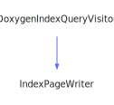

<h1>ListItemVisitor</h1>

<a href="https://github.com/CharlesCarley/MdDox#~">~</a>
<a href="indexpage.md#mddox">MdDox</a>
/
<a href="index.md#index">Index</a>
/
<a href="namespaceMdDox.md#mddox">MdDox</a>
::
<b>ListItemVisitor</b>
 
 

<h4>Derived From</h4>

<a href="classMdDox_1_1Doxygen_1_1Visitors_1_1ParamListItemQueryVisitor.md#paramlistitemqueryvisitor">MdDox::Doxygen::Visitors::ParamListItemQueryVisitor</a>

 

<h2>Private Members</h2>
<a href="#_out" class="icon-list-item">_out
</a>

 
<a href="#_stream" class="icon-list-item">_stream
</a>

 
<a href="#_writer" class="icon-list-item">_writer
</a>

 

<h2>Private Methods</h2>
<a href="#visitedparameterdescription" class="icon-list-item">visitedParameterDescription
</a>

 
<a href="#visitedparameternamelist" class="icon-list-item">visitedParameterNameList
</a>

 

<h2>Public Methods</h2>
<a href="#listitemvisitor" class="icon-list-item">ListItemVisitor
</a>

 
<a href="#write" class="icon-list-item">write
</a>

 

<h4>Defined in</h4>
<a href="https://github.com/CharlesCarley/MdDox/blob/master/Source/MdDoxTree/ParameterListWriter.cpp#L64" class="icon-list-item">ParameterListWriter.cpp
</a>

 
 
<blockquote>
<a href="#listitemvisitor" class="icon-list-item">top
</a>

</blockquote>

<h2>_out</h2>
<a href="namespaceMdDox.md#outputstringstream">OutputStringStream</a>
<b>_out</b>
 

<h4>Defined in</h4>
<a href="https://github.com/CharlesCarley/MdDox/blob/master/Source/MdDoxTree/ParameterListWriter.cpp#L68" class="icon-list-item">ParameterListWriter.cpp
</a>

 
 
<blockquote>
<a href="#listitemvisitor" class="icon-list-item">top
</a>

</blockquote>
 

<h2>_stream</h2>
<a href="namespaceMdDox.md#ostream">OStream</a>
 *
<b>_stream</b>
 

<h4>Defined in</h4>
<a href="https://github.com/CharlesCarley/MdDox/blob/master/Source/MdDoxTree/ParameterListWriter.cpp#L67" class="icon-list-item">ParameterListWriter.cpp
</a>

 
 
<blockquote>
<a href="#listitemvisitor" class="icon-list-item">top
</a>

</blockquote>
 

<h2>_writer</h2>
<a href="classMdDox_1_1DocumentWriter.md#documentwriter">DocumentWriter</a>
 *
<b>_writer</b>
 

<h4>Defined in</h4>
<a href="https://github.com/CharlesCarley/MdDox/blob/master/Source/MdDoxTree/ParameterListWriter.cpp#L66" class="icon-list-item">ParameterListWriter.cpp
</a>

 
 
<blockquote>
<a href="#listitemvisitor" class="icon-list-item">top
</a>

</blockquote>
 

<h2>visitedParameterDescription</h2>
void
<b>visitedParameterDescription</b>
<i>(</i>

const 
<a href="classMdDox_1_1Doxygen_1_1DescriptionQuery.md#descriptionquery">Doxygen::DescriptionQuery</a>
 &amp;
query

<i>)</i>

<h4>Details</h4>
Called when the element 
<b>parameterdescription</b>
 is found. 
 
 
<ul>
<li><b>query</b>
 - 
Const reference to the DescriptionQuery class. 
</li>
</ul>
 

<h4>Defined in</h4>
<a href="https://github.com/CharlesCarley/MdDox/blob/master/Source/MdDoxTree/ParameterListWriter.cpp#L76" class="icon-list-item">ParameterListWriter.cpp
</a>

 
 
<blockquote>
<a href="#listitemvisitor" class="icon-list-item">top
</a>

</blockquote>
 

<h2>visitedParameterNameList</h2>
void
<b>visitedParameterNameList</b>
<i>(</i>

const 
<a href="classMdDox_1_1Doxygen_1_1ParamNameListQuery.md#paramnamelistquery">Doxygen::ParamNameListQuery</a>
 &amp;
query

<i>)</i>

<h4>Details</h4>
Called when the element 
<b>parameternamelist</b>
 is found. 
 
 
<ul>
<li><b>query</b>
 - 
Const reference to the ParamNameListQuery class. 
</li>
</ul>
 

<h4>Defined in</h4>
<a href="https://github.com/CharlesCarley/MdDox/blob/master/Source/MdDoxTree/ParameterListWriter.cpp#L70" class="icon-list-item">ParameterListWriter.cpp
</a>

 
 
<blockquote>
<a href="#listitemvisitor" class="icon-list-item">top
</a>

</blockquote>
 

<h2>ListItemVisitor</h2>
<b>ListItemVisitor</b>
<i>(</i>

<a href="classMdDox_1_1DocumentWriter.md#documentwriter">DocumentWriter</a>
 *
writer

<a href="namespaceMdDox.md#ostream">OStream</a>
 *
out

<i>)</i>

<h4>Defined in</h4>
<a href="https://github.com/CharlesCarley/MdDox/blob/master/Source/MdDoxTree/ParameterListWriter.cpp#L83" class="icon-list-item">ParameterListWriter.cpp
</a>

 
 
<blockquote>
<a href="#listitemvisitor" class="icon-list-item">top
</a>

</blockquote>
 

<h2>write</h2>
bool
<b>write</b>
<i>(</i>

const 
<a href="classMdDox_1_1Doxygen_1_1ParamListItemQuery.md#paramlistitemquery">Doxygen::ParamListItemQuery</a>
 &amp;
paramList

<i>)</i>

<h4>References</h4>

<a href="classMdDox_1_1Doxygen_1_1Query.md#isvalid">isValid</a>

<a href="classMdDox_1_1DocumentWriter.md#beginlistitem">beginListItem</a>

<a href="classMdDox_1_1Doxygen_1_1ParamListItemQuery.md#visit">visit</a>

<a href="classMdDox_1_1DocumentWriter.md#endlistitem">endListItem</a>

<a href="namespaceMdDox.md#syncstream">syncStream</a>

<h4>Defined in</h4>
<a href="https://github.com/CharlesCarley/MdDox/blob/master/Source/MdDoxTree/ParameterListWriter.cpp#L89" class="icon-list-item">ParameterListWriter.cpp
</a>

 
 
<blockquote>
<a href="#listitemvisitor" class="icon-list-item">top
</a>

</blockquote>
 

</body>
</html>
