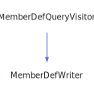

<h1>NamespacePageWriter</h1>

<a href="https://github.com/CharlesCarley/MdDox.md">~</a>
<a href="indexpage.md#mddox">MdDox</a>
/
<a href="index.md#index">Index</a>
/
<a href="namespaceMdDox.md#mddox">MdDox</a>
::
<b>NamespacePageWriter</b>
 
 

<h4>Derived From</h4>

<a href="classMdDox_1_1PageWriter.md#mddoxpagewriter">MdDox::PageWriter</a>

 

<h2>Private Members</h2>
<a href="#_classheading" class="icon-list-item">_classHeading
</a>

 
<a href="#_namespaceheading" class="icon-list-item">_namespaceHeading
</a>

 

<h2>Private Methods</h2>
<a href="#notifybriefdescription" class="icon-list-item">notifyBriefDescription
</a>

 
<a href="#notifydetaildescriptionheading" class="icon-list-item">notifyDetailDescriptionHeading
</a>

 
<a href="#presortquery" class="icon-list-item">preSortQuery
</a>

 
<a href="#visitedbasecompoundref" class="icon-list-item">visitedBaseCompoundRef
</a>

 
<a href="#visitedcollaborationgraph" class="icon-list-item">visitedCollaborationGraph
</a>

 
<a href="#visitedcompoundname" class="icon-list-item">visitedCompoundName
</a>

 
<a href="#visitedderivedcompoundref" class="icon-list-item">visitedDerivedCompoundRef
</a>

 
<a href="#visitedincdepgraph" class="icon-list-item">visitedIncDepGraph
</a>

 
<a href="#visitedincludedby" class="icon-list-item">visitedIncludedBy
</a>

 
<a href="#visitedincludes" class="icon-list-item">visitedIncludes
</a>

 
<a href="#visitedinheritancegraph" class="icon-list-item">visitedInheritanceGraph
</a>

 
<a href="#visitedinnerclass" class="icon-list-item">visitedInnerClass
</a>

 
<a href="#visitedinnerdir" class="icon-list-item">visitedInnerDir
</a>

 
<a href="#visitedinnerfile" class="icon-list-item">visitedInnerFile
</a>

 
<a href="#visitedinnergroup" class="icon-list-item">visitedInnerGroup
</a>

 
<a href="#visitedinnernamespace" class="icon-list-item">visitedInnerNamespace
</a>

 
<a href="#visitedinnerpage" class="icon-list-item">visitedInnerPage
</a>

 
<a href="#visitedinvincdepgraph" class="icon-list-item">visitedInvIncDepGraph
</a>

 
<a href="#visitedlistofallmembers" class="icon-list-item">visitedListOfAllMembers
</a>

 
<a href="#visitedlocation" class="icon-list-item">visitedLocation
</a>

 
<a href="#visitedprogramlisting" class="icon-list-item">visitedProgramListing
</a>

 
<a href="#visitedtableofcontents" class="icon-list-item">visitedTableOfContents
</a>

 
<a href="#visitedtemplateparamlist" class="icon-list-item">visitedTemplateParamList
</a>

 
<a href="#visitedtitle" class="icon-list-item">visitedTitle
</a>

 
<a href="#writetableofcontents" class="icon-list-item">writeTableOfContents
</a>

 

<h2>Public Methods</h2>
<a href="#namespacepagewriter" class="icon-list-item">NamespacePageWriter
</a>

 
<a href="#~namespacepagewriter" class="icon-list-item">~NamespacePageWriter
</a>

 

<h4>Defined in</h4>
<a href="https://github.com/CharlesCarley/MdDox/blob/master//Source/MdDoxTree/NamespacePageWriter.h#L33" class="icon-list-item">NamespacePageWriter.h
</a>

 

<h2>_classHeading</h2>
bool
<b>_classHeading</b>
 

<h4>Defined in</h4>
<a href="https://github.com/CharlesCarley/MdDox/blob/master//Source/MdDoxTree/NamespacePageWriter.h#L36" class="icon-list-item">NamespacePageWriter.h
</a>

 
 

<h2>_namespaceHeading</h2>
bool
<b>_namespaceHeading</b>
 

<h4>Defined in</h4>
<a href="https://github.com/CharlesCarley/MdDox/blob/master//Source/MdDoxTree/NamespacePageWriter.h#L35" class="icon-list-item">NamespacePageWriter.h
</a>

 
 

<h2>notifyBriefDescription</h2>
void
<b>notifyBriefDescription</b>
<i>(</i>

const 
<a href="classMdDox_1_1Doxygen_1_1DescriptionQuery.md#doxygendescriptionquery">Doxygen::DescriptionQuery</a>
 &amp;
query

<i>)</i>

<h4>Defined in</h4>
<a href="https://github.com/CharlesCarley/MdDox/blob/master//Source/MdDoxTree/NamespacePageWriter.h#L84" class="icon-list-item">NamespacePageWriter.h
</a>

 
<a href="https://github.com/CharlesCarley/MdDox/blob/master//Source/MdDoxTree/NamespacePageWriter.cpp#L256" class="icon-list-item">NamespacePageWriter.cpp
</a>

 
 

<h2>notifyDetailDescriptionHeading</h2>
void
<b>notifyDetailDescriptionHeading</b>
<i>(</i>

const 
<a href="classMdDox_1_1Doxygen_1_1DescriptionQuery.md#doxygendescriptionquery">Doxygen::DescriptionQuery</a>
 &amp;
query

<i>)</i>

<h4>Defined in</h4>
<a href="https://github.com/CharlesCarley/MdDox/blob/master//Source/MdDoxTree/NamespacePageWriter.h#L85" class="icon-list-item">NamespacePageWriter.h
</a>

 
<a href="https://github.com/CharlesCarley/MdDox/blob/master//Source/MdDoxTree/NamespacePageWriter.cpp#L261" class="icon-list-item">NamespacePageWriter.cpp
</a>

 
 

<h2>preSortQuery</h2>
void
<b>preSortQuery</b>
<i>(</i>

const 
<a href="classMdDox_1_1Doxygen_1_1CompoundDefQuery.md#doxygencompounddefquery">Doxygen::CompoundDefQuery</a>
 &amp;
query

<i>)</i>

<h4>Defined in</h4>
<a href="https://github.com/CharlesCarley/MdDox/blob/master//Source/MdDoxTree/NamespacePageWriter.h#L82" class="icon-list-item">NamespacePageWriter.h
</a>

 
<a href="https://github.com/CharlesCarley/MdDox/blob/master//Source/MdDoxTree/NamespacePageWriter.cpp#L317" class="icon-list-item">NamespacePageWriter.cpp
</a>

 
 

<h2>visitedBaseCompoundRef</h2>
void
<b>visitedBaseCompoundRef</b>
<i>(</i>

const 
<a href="classMdDox_1_1Doxygen_1_1CompoundRefQuery.md#doxygencompoundrefquery">Doxygen::CompoundRefQuery</a>
 &amp;
query

<i>)</i>

<h4>Details</h4>
Called when the element 
<b>basecompoundref</b>
 is found. 
 
 
<ul>
<li><b>query</b>
 - 
Const reference to the CompoundRefQuery class. 
</li>
</ul>
 

<h4>Defined in</h4>
<a href="https://github.com/CharlesCarley/MdDox/blob/master//Source/MdDoxTree/NamespacePageWriter.h#L44" class="icon-list-item">NamespacePageWriter.h
</a>

 
<a href="https://github.com/CharlesCarley/MdDox/blob/master//Source/MdDoxTree/NamespacePageWriter.cpp#L162" class="icon-list-item">NamespacePageWriter.cpp
</a>

 
 

<h2>visitedCollaborationGraph</h2>
void
<b>visitedCollaborationGraph</b>
<i>(</i>

const 
<a href="classMdDox_1_1Doxygen_1_1GraphQuery.md#doxygengraphquery">Doxygen::GraphQuery</a>
 &amp;
query

<i>)</i>

<h4>Details</h4>
Called when the element 
<b>collaborationgraph</b>
 is found. 
 
 
<ul>
<li><b>query</b>
 - 
Const reference to the GraphQuery class. 
</li>
</ul>
 

<h4>Defined in</h4>
<a href="https://github.com/CharlesCarley/MdDox/blob/master//Source/MdDoxTree/NamespacePageWriter.h#L68" class="icon-list-item">NamespacePageWriter.h
</a>

 
<a href="https://github.com/CharlesCarley/MdDox/blob/master//Source/MdDoxTree/NamespacePageWriter.cpp#L202" class="icon-list-item">NamespacePageWriter.cpp
</a>

 
 

<h2>visitedCompoundName</h2>
void
<b>visitedCompoundName</b>
<i>(</i>

const 
<a href="namespaceMdDox.md#string">String</a>
 &amp;
text

<i>)</i>

<h4>Details</h4>
Called when the element 
<b>compoundname</b>
 is found. 
 
 
<ul>
<li><b>text</b>
 - 
Const reference to the internal text. 
</li>
</ul>
 

<h4>Defined in</h4>
<a href="https://github.com/CharlesCarley/MdDox/blob/master//Source/MdDoxTree/NamespacePageWriter.h#L42" class="icon-list-item">NamespacePageWriter.h
</a>

 
<a href="https://github.com/CharlesCarley/MdDox/blob/master//Source/MdDoxTree/NamespacePageWriter.cpp#L127" class="icon-list-item">NamespacePageWriter.cpp
</a>

 
 

<h2>visitedDerivedCompoundRef</h2>
void
<b>visitedDerivedCompoundRef</b>
<i>(</i>

const 
<a href="classMdDox_1_1Doxygen_1_1CompoundRefQuery.md#doxygencompoundrefquery">Doxygen::CompoundRefQuery</a>
 &amp;
query

<i>)</i>

<h4>Details</h4>
Called when the element 
<b>derivedcompoundref</b>
 is found. 
 
 
<ul>
<li><b>query</b>
 - 
Const reference to the CompoundRefQuery class. 
</li>
</ul>
 

<h4>Defined in</h4>
<a href="https://github.com/CharlesCarley/MdDox/blob/master//Source/MdDoxTree/NamespacePageWriter.h#L46" class="icon-list-item">NamespacePageWriter.h
</a>

 
<a href="https://github.com/CharlesCarley/MdDox/blob/master//Source/MdDoxTree/NamespacePageWriter.cpp#L167" class="icon-list-item">NamespacePageWriter.cpp
</a>

 
 

<h2>visitedIncDepGraph</h2>
void
<b>visitedIncDepGraph</b>
<i>(</i>

const 
<a href="classMdDox_1_1Doxygen_1_1GraphQuery.md#doxygengraphquery">Doxygen::GraphQuery</a>
 &amp;
query

<i>)</i>

<h4>Details</h4>
Called when the element 
<b>incdepgraph</b>
 is found. 
 
 
<ul>
<li><b>query</b>
 - 
Const reference to the GraphQuery class. 
</li>
</ul>
 

<h4>Defined in</h4>
<a href="https://github.com/CharlesCarley/MdDox/blob/master//Source/MdDoxTree/NamespacePageWriter.h#L60" class="icon-list-item">NamespacePageWriter.h
</a>

 
<a href="https://github.com/CharlesCarley/MdDox/blob/master//Source/MdDoxTree/NamespacePageWriter.cpp#L182" class="icon-list-item">NamespacePageWriter.cpp
</a>

 
 

<h2>visitedIncludedBy</h2>
void
<b>visitedIncludedBy</b>
<i>(</i>

const 
<a href="classMdDox_1_1Doxygen_1_1IncQuery.md#doxygenincquery">Doxygen::IncQuery</a>
 &amp;
query

<i>)</i>

<h4>Details</h4>
Called when the element 
<b>includedby</b>
 is found. 
 
 
<ul>
<li><b>query</b>
 - 
Const reference to the IncQuery class. 
</li>
</ul>
 

<h4>Defined in</h4>
<a href="https://github.com/CharlesCarley/MdDox/blob/master//Source/MdDoxTree/NamespacePageWriter.h#L50" class="icon-list-item">NamespacePageWriter.h
</a>

 
<a href="https://github.com/CharlesCarley/MdDox/blob/master//Source/MdDoxTree/NamespacePageWriter.cpp#L177" class="icon-list-item">NamespacePageWriter.cpp
</a>

 
 

<h2>visitedIncludes</h2>
void
<b>visitedIncludes</b>
<i>(</i>

const 
<a href="classMdDox_1_1Doxygen_1_1IncQuery.md#doxygenincquery">Doxygen::IncQuery</a>
 &amp;
query

<i>)</i>

<h4>Details</h4>
Called when the element 
<b>includes</b>
 is found. 
 
 
<ul>
<li><b>query</b>
 - 
Const reference to the IncQuery class. 
</li>
</ul>
 

<h4>Defined in</h4>
<a href="https://github.com/CharlesCarley/MdDox/blob/master//Source/MdDoxTree/NamespacePageWriter.h#L48" class="icon-list-item">NamespacePageWriter.h
</a>

 
<a href="https://github.com/CharlesCarley/MdDox/blob/master//Source/MdDoxTree/NamespacePageWriter.cpp#L172" class="icon-list-item">NamespacePageWriter.cpp
</a>

 
 

<h2>visitedInheritanceGraph</h2>
void
<b>visitedInheritanceGraph</b>
<i>(</i>

const 
<a href="classMdDox_1_1Doxygen_1_1GraphQuery.md#doxygengraphquery">Doxygen::GraphQuery</a>
 &amp;
query

<i>)</i>

<h4>Details</h4>
Called when the element 
<b>inheritancegraph</b>
 is found. 
 
 
<ul>
<li><b>query</b>
 - 
Const reference to the GraphQuery class. 
</li>
</ul>
 

<h4>Defined in</h4>
<a href="https://github.com/CharlesCarley/MdDox/blob/master//Source/MdDoxTree/NamespacePageWriter.h#L66" class="icon-list-item">NamespacePageWriter.h
</a>

 
<a href="https://github.com/CharlesCarley/MdDox/blob/master//Source/MdDoxTree/NamespacePageWriter.cpp#L197" class="icon-list-item">NamespacePageWriter.cpp
</a>

 
 

<h2>visitedInnerClass</h2>
void
<b>visitedInnerClass</b>
<i>(</i>

const 
<a href="classMdDox_1_1Doxygen_1_1RefQuery.md#doxygenrefquery">Doxygen::RefQuery</a>
 &amp;
query

<i>)</i>

<h4>Details</h4>
Called when the element 
<b>innerclass</b>
 is found. 
 
 
<ul>
<li><b>query</b>
 - 
Const reference to the RefQuery class. 
</li>
</ul>
 

<h4>Defined in</h4>
<a href="https://github.com/CharlesCarley/MdDox/blob/master//Source/MdDoxTree/NamespacePageWriter.h#L38" class="icon-list-item">NamespacePageWriter.h
</a>

 
<a href="https://github.com/CharlesCarley/MdDox/blob/master//Source/MdDoxTree/NamespacePageWriter.cpp#L132" class="icon-list-item">NamespacePageWriter.cpp
</a>

 
 

<h2>visitedInnerDir</h2>
void
<b>visitedInnerDir</b>
<i>(</i>

const 
<a href="classMdDox_1_1Doxygen_1_1RefQuery.md#doxygenrefquery">Doxygen::RefQuery</a>
 &amp;
query

<i>)</i>

<h4>Details</h4>
Called when the element 
<b>innerdir</b>
 is found. 
 
 
<ul>
<li><b>query</b>
 - 
Const reference to the RefQuery class. 
</li>
</ul>
 

<h4>Defined in</h4>
<a href="https://github.com/CharlesCarley/MdDox/blob/master//Source/MdDoxTree/NamespacePageWriter.h#L52" class="icon-list-item">NamespacePageWriter.h
</a>

 
<a href="https://github.com/CharlesCarley/MdDox/blob/master//Source/MdDoxTree/NamespacePageWriter.cpp#L236" class="icon-list-item">NamespacePageWriter.cpp
</a>

 
 

<h2>visitedInnerFile</h2>
void
<b>visitedInnerFile</b>
<i>(</i>

const 
<a href="classMdDox_1_1Doxygen_1_1RefQuery.md#doxygenrefquery">Doxygen::RefQuery</a>
 &amp;
query

<i>)</i>

<h4>Details</h4>
Called when the element 
<b>innerfile</b>
 is found. 
 
 
<ul>
<li><b>query</b>
 - 
Const reference to the RefQuery class. 
</li>
</ul>
 

<h4>Defined in</h4>
<a href="https://github.com/CharlesCarley/MdDox/blob/master//Source/MdDoxTree/NamespacePageWriter.h#L54" class="icon-list-item">NamespacePageWriter.h
</a>

 
<a href="https://github.com/CharlesCarley/MdDox/blob/master//Source/MdDoxTree/NamespacePageWriter.cpp#L241" class="icon-list-item">NamespacePageWriter.cpp
</a>

 
 

<h2>visitedInnerGroup</h2>
void
<b>visitedInnerGroup</b>
<i>(</i>

const 
<a href="classMdDox_1_1Doxygen_1_1RefQuery.md#doxygenrefquery">Doxygen::RefQuery</a>
 &amp;
query

<i>)</i>

<h4>Details</h4>
Called when the element 
<b>innergroup</b>
 is found. 
 
 
<ul>
<li><b>query</b>
 - 
Const reference to the RefQuery class. 
</li>
</ul>
 

<h4>Defined in</h4>
<a href="https://github.com/CharlesCarley/MdDox/blob/master//Source/MdDoxTree/NamespacePageWriter.h#L58" class="icon-list-item">NamespacePageWriter.h
</a>

 
<a href="https://github.com/CharlesCarley/MdDox/blob/master//Source/MdDoxTree/NamespacePageWriter.cpp#L251" class="icon-list-item">NamespacePageWriter.cpp
</a>

 
 

<h2>visitedInnerNamespace</h2>
void
<b>visitedInnerNamespace</b>
<i>(</i>

const 
<a href="classMdDox_1_1Doxygen_1_1RefQuery.md#doxygenrefquery">Doxygen::RefQuery</a>
 &amp;
query

<i>)</i>

<h4>Details</h4>
Called when the element 
<b>innernamespace</b>
 is found. 
 
 
<ul>
<li><b>query</b>
 - 
Const reference to the RefQuery class. 
</li>
</ul>
 

<h4>Defined in</h4>
<a href="https://github.com/CharlesCarley/MdDox/blob/master//Source/MdDoxTree/NamespacePageWriter.h#L40" class="icon-list-item">NamespacePageWriter.h
</a>

 
<a href="https://github.com/CharlesCarley/MdDox/blob/master//Source/MdDoxTree/NamespacePageWriter.cpp#L147" class="icon-list-item">NamespacePageWriter.cpp
</a>

 
 

<h2>visitedInnerPage</h2>
void
<b>visitedInnerPage</b>
<i>(</i>

const 
<a href="classMdDox_1_1Doxygen_1_1RefQuery.md#doxygenrefquery">Doxygen::RefQuery</a>
 &amp;
query

<i>)</i>

<h4>Details</h4>
Called when the element 
<b>innerpage</b>
 is found. 
 
 
<ul>
<li><b>query</b>
 - 
Const reference to the RefQuery class. 
</li>
</ul>
 

<h4>Defined in</h4>
<a href="https://github.com/CharlesCarley/MdDox/blob/master//Source/MdDoxTree/NamespacePageWriter.h#L56" class="icon-list-item">NamespacePageWriter.h
</a>

 
<a href="https://github.com/CharlesCarley/MdDox/blob/master//Source/MdDoxTree/NamespacePageWriter.cpp#L246" class="icon-list-item">NamespacePageWriter.cpp
</a>

 
 

<h2>visitedInvIncDepGraph</h2>
void
<b>visitedInvIncDepGraph</b>
<i>(</i>

const 
<a href="classMdDox_1_1Doxygen_1_1GraphQuery.md#doxygengraphquery">Doxygen::GraphQuery</a>
 &amp;
query

<i>)</i>

<h4>Details</h4>
Called when the element 
<b>invincdepgraph</b>
 is found. 
 
 
<ul>
<li><b>query</b>
 - 
Const reference to the GraphQuery class. 
</li>
</ul>
 

<h4>Defined in</h4>
<a href="https://github.com/CharlesCarley/MdDox/blob/master//Source/MdDoxTree/NamespacePageWriter.h#L62" class="icon-list-item">NamespacePageWriter.h
</a>

 
<a href="https://github.com/CharlesCarley/MdDox/blob/master//Source/MdDoxTree/NamespacePageWriter.cpp#L187" class="icon-list-item">NamespacePageWriter.cpp
</a>

 
 

<h2>visitedListOfAllMembers</h2>
void
<b>visitedListOfAllMembers</b>
<i>(</i>

const 
<a href="classMdDox_1_1Doxygen_1_1ListOfAllMembersQuery.md#doxygenlistofallmembersquery">Doxygen::ListOfAllMembersQuery</a>
 &amp;
query

<i>)</i>

<h4>Details</h4>
Called when the element 
<b>listofallmembers</b>
 is found. 
 
 
<ul>
<li><b>query</b>
 - 
Const reference to the ListOfAllMembersQuery class. 
</li>
</ul>
 

<h4>Defined in</h4>
<a href="https://github.com/CharlesCarley/MdDox/blob/master//Source/MdDoxTree/NamespacePageWriter.h#L74" class="icon-list-item">NamespacePageWriter.h
</a>

 
<a href="https://github.com/CharlesCarley/MdDox/blob/master//Source/MdDoxTree/NamespacePageWriter.cpp#L221" class="icon-list-item">NamespacePageWriter.cpp
</a>

 
 

<h2>visitedLocation</h2>
void
<b>visitedLocation</b>
<i>(</i>

const 
<a href="classMdDox_1_1Doxygen_1_1LocationQuery.md#doxygenlocationquery">Doxygen::LocationQuery</a>
 &amp;
query

<i>)</i>

<h4>Details</h4>
Called when the element 
<b>location</b>
 is found. 
 
 
<ul>
<li><b>query</b>
 - 
Const reference to the LocationQuery class. 
</li>
</ul>
 

<h4>Defined in</h4>
<a href="https://github.com/CharlesCarley/MdDox/blob/master//Source/MdDoxTree/NamespacePageWriter.h#L72" class="icon-list-item">NamespacePageWriter.h
</a>

 
<a href="https://github.com/CharlesCarley/MdDox/blob/master//Source/MdDoxTree/NamespacePageWriter.cpp#L212" class="icon-list-item">NamespacePageWriter.cpp
</a>

 
 

<h2>visitedProgramListing</h2>
void
<b>visitedProgramListing</b>
<i>(</i>

const 
<a href="classMdDox_1_1Doxygen_1_1ListingQuery.md#doxygenlistingquery">Doxygen::ListingQuery</a>
 &amp;
query

<i>)</i>

<h4>Details</h4>
Called when the element 
<b>programlisting</b>
 is found. 
 
 
<ul>
<li><b>query</b>
 - 
Const reference to the ListingQuery class. 
</li>
</ul>
 

<h4>Defined in</h4>
<a href="https://github.com/CharlesCarley/MdDox/blob/master//Source/MdDoxTree/NamespacePageWriter.h#L70" class="icon-list-item">NamespacePageWriter.h
</a>

 
<a href="https://github.com/CharlesCarley/MdDox/blob/master//Source/MdDoxTree/NamespacePageWriter.cpp#L207" class="icon-list-item">NamespacePageWriter.cpp
</a>

 
 

<h2>visitedTableOfContents</h2>
void
<b>visitedTableOfContents</b>
<i>(</i>

const 
<a href="namespaceMdDox.md#string">String</a>
 &amp;
text

<i>)</i>

<h4>Details</h4>
Called when the element 
<b>tableofcontents</b>
 is found. 
 
 
<ul>
<li><b>text</b>
 - 
Const reference to the internal text. 
</li>
</ul>
 

<h4>Defined in</h4>
<a href="https://github.com/CharlesCarley/MdDox/blob/master//Source/MdDoxTree/NamespacePageWriter.h#L78" class="icon-list-item">NamespacePageWriter.h
</a>

 
<a href="https://github.com/CharlesCarley/MdDox/blob/master//Source/MdDoxTree/NamespacePageWriter.cpp#L231" class="icon-list-item">NamespacePageWriter.cpp
</a>

 
 

<h2>visitedTemplateParamList</h2>
void
<b>visitedTemplateParamList</b>
<i>(</i>

const 
<a href="classMdDox_1_1Doxygen_1_1TemplateParamListQuery.md#doxygentemplateparamlistquery">Doxygen::TemplateParamListQuery</a>
 &amp;
query

<i>)</i>

<h4>Details</h4>
Called when the element 
<b>templateparamlist</b>
 is found. 
 
 
<ul>
<li><b>query</b>
 - 
Const reference to the TemplateParamListQuery class. 
</li>
</ul>
 

<h4>Defined in</h4>
<a href="https://github.com/CharlesCarley/MdDox/blob/master//Source/MdDoxTree/NamespacePageWriter.h#L64" class="icon-list-item">NamespacePageWriter.h
</a>

 
<a href="https://github.com/CharlesCarley/MdDox/blob/master//Source/MdDoxTree/NamespacePageWriter.cpp#L192" class="icon-list-item">NamespacePageWriter.cpp
</a>

 
 

<h2>visitedTitle</h2>
void
<b>visitedTitle</b>
<i>(</i>

const 
<a href="namespaceMdDox.md#string">String</a>
 &amp;
text

<i>)</i>

<h4>Details</h4>
Called when the element 
<b>title</b>
 is found. 
 
 
<ul>
<li><b>text</b>
 - 
Const reference to the internal text. 
</li>
</ul>
 

<h4>Defined in</h4>
<a href="https://github.com/CharlesCarley/MdDox/blob/master//Source/MdDoxTree/NamespacePageWriter.h#L76" class="icon-list-item">NamespacePageWriter.h
</a>

 
<a href="https://github.com/CharlesCarley/MdDox/blob/master//Source/MdDoxTree/NamespacePageWriter.cpp#L226" class="icon-list-item">NamespacePageWriter.cpp
</a>

 
 

<h2>writeTableOfContents</h2>
void
<b>writeTableOfContents</b>
<i>(</i>

<a href="classMdDox_1_1Xml_1_1Node.md#xmlnode">Xml::Node</a>
 *
compoundDef

<i>)</i>

<h4>Defined in</h4>
<a href="https://github.com/CharlesCarley/MdDox/blob/master//Source/MdDoxTree/NamespacePageWriter.h#L80" class="icon-list-item">NamespacePageWriter.h
</a>

 
<a href="https://github.com/CharlesCarley/MdDox/blob/master//Source/MdDoxTree/NamespacePageWriter.cpp#L266" class="icon-list-item">NamespacePageWriter.cpp
</a>

 
 

<h2>NamespacePageWriter</h2>
<b>NamespacePageWriter</b>
<i>(</i>

<a href="classMdDox_1_1DocumentWriter.md#documentwriter">DocumentWriter</a>
 *
writer

const 
<a href="classMdDox_1_1Reference.md#reference">Reference</a>
 &amp;
ref

const 
<a href="classMdDox_1_1PathUtil.md#pathutil">PathUtil</a>
 &amp;
out

<i>)</i>

<h4>Defined in</h4>
<a href="https://github.com/CharlesCarley/MdDox/blob/master//Source/MdDoxTree/NamespacePageWriter.h#L88" class="icon-list-item">NamespacePageWriter.h
</a>

 
<a href="https://github.com/CharlesCarley/MdDox/blob/master//Source/MdDoxTree/NamespacePageWriter.cpp#L120" class="icon-list-item">NamespacePageWriter.cpp
</a>

 
 

<h2>~NamespacePageWriter</h2>
<b>~NamespacePageWriter</b>
<i>(</i>
<i>)</i>

<h4>Defined in</h4>
<a href="https://github.com/CharlesCarley/MdDox/blob/master//Source/MdDoxTree/NamespacePageWriter.h#L89" class="icon-list-item">NamespacePageWriter.h
</a>

 
 

</body>
</html>
