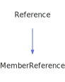

<h1>ParameterListWriter</h1>

<a href="https://github.com/CharlesCarley/MdDox">~</a>
<a href="indexpage.md#mddox">MdDox</a>
/
<a href="index.md#index">Index</a>
/
<a href="namespaceMdDox.md#mddox">MdDox</a>
::
<b>ParameterListWriter</b>
 
 

<h4>Derived From</h4>
<a href="classMdDox_1_1Doxygen_1_1Visitors_1_1ParamListQueryVisitor.md#paramlistqueryvisitor" class="icon-list-item">ParamListQueryVisitor
</a>

 
 

<h2>Private Members</h2>
<a href="#_out" class="icon-list-item">_out
</a>

 
<a href="#_stream" class="icon-list-item">_stream
</a>

 
<a href="#_writer" class="icon-list-item">_writer
</a>

 

<h2>Private Methods</h2>
<a href="#visitedparameteritem" class="icon-list-item">visitedParameterItem
</a>

 

<h2>Public Methods</h2>
<a href="#parameterlistwriter" class="icon-list-item">ParameterListWriter
</a>

 
<a href="#write" class="icon-list-item">write
</a>

 

<h4>Defined in</h4>
<a href="https://github.com/CharlesCarley/MdDox/blob/master//F:/Emulation/MdDox/Source/MdDoxTree/ParameterListWriter.h#L31" class="icon-list-item">ParameterListWriter.h
</a>

 

<h2>_out</h2>
<a href="namespaceMdDox.md#outputstringstream">OutputStringStream</a>
<b>_out</b>
 

<h4>Defined in</h4>
<a href="https://github.com/CharlesCarley/MdDox/blob/master//F:/Emulation/MdDox/Source/MdDoxTree/ParameterListWriter.h#L35" class="icon-list-item">ParameterListWriter.h
</a>

 
 

<h2>_stream</h2>
<a href="namespaceMdDox.md#ostream">OStream</a>
 *
<b>_stream</b>
 

<h4>Defined in</h4>
<a href="https://github.com/CharlesCarley/MdDox/blob/master//F:/Emulation/MdDox/Source/MdDoxTree/ParameterListWriter.h#L34" class="icon-list-item">ParameterListWriter.h
</a>

 
 

<h2>_writer</h2>
<a href="classMdDox_1_1DocumentWriter.md#documentwriter">DocumentWriter</a>
 *
<b>_writer</b>
 

<h4>Defined in</h4>
<a href="https://github.com/CharlesCarley/MdDox/blob/master//F:/Emulation/MdDox/Source/MdDoxTree/ParameterListWriter.h#L33" class="icon-list-item">ParameterListWriter.h
</a>

 
 

<h2>visitedParameterItem</h2>
void
<b>visitedParameterItem</b>
<i>(</i>

const 
<a href="classMdDox_1_1Doxygen_1_1ParamListItemQuery.md#doxygenparamlistitemquery">Doxygen::ParamListItemQuery</a>
 &amp;
query

<i>)</i>

<h4>Details</h4>
Called when the element 
<b>parameteritem</b>
 is found. 
 
 
<ul>
<li><b>query</b>
 - 
Const reference to the ParamListItemQuery class. 
</li>
</ul>
 

<h4>Defined in</h4>
<a href="https://github.com/CharlesCarley/MdDox/blob/master//F:/Emulation/MdDox/Source/MdDoxTree/ParameterListWriter.h#L37" class="icon-list-item">ParameterListWriter.h
</a>

 
<a href="https://github.com/CharlesCarley/MdDox/blob/master//F:/Emulation/MdDox/Source/MdDoxTree/ParameterListWriter.cpp#L108" class="icon-list-item">ParameterListWriter.cpp
</a>

 
 

<h2>ParameterListWriter</h2>
<b>ParameterListWriter</b>
<i>(</i>

<a href="classMdDox_1_1DocumentWriter.md#documentwriter">DocumentWriter</a>
 *
writer

<a href="namespaceMdDox.md#ostream">OStream</a>
 *
out

<i>)</i>

<h4>Defined in</h4>
<a href="https://github.com/CharlesCarley/MdDox/blob/master//F:/Emulation/MdDox/Source/MdDoxTree/ParameterListWriter.h#L40" class="icon-list-item">ParameterListWriter.h
</a>

 
<a href="https://github.com/CharlesCarley/MdDox/blob/master//F:/Emulation/MdDox/Source/MdDoxTree/ParameterListWriter.cpp#L102" class="icon-list-item">ParameterListWriter.cpp
</a>

 
 

<h2>write</h2>
bool
<b>write</b>
<i>(</i>

const 
<a href="classMdDox_1_1Doxygen_1_1ParamListQuery.md#doxygenparamlistquery">Doxygen::ParamListQuery</a>
 &amp;
paramList

<i>)</i>

<h4>References</h4>
<a href="classMdDox_1_1Doxygen_1_1Query.md#isvalid" class="icon-list-item">isValid
</a>

 
<a href="classMdDox_1_1DocumentWriter.md#beginlist" class="icon-list-item">beginList
</a>

 
<a href="classMdDox_1_1Doxygen_1_1ParamListQuery.md#visit" class="icon-list-item">visit
</a>

 
<a href="classMdDox_1_1DocumentWriter.md#endlist" class="icon-list-item">endList
</a>

 
<a href="namespaceMdDox.md#syncstream" class="icon-list-item">syncStream
</a>

 

<h4>Defined in</h4>
<a href="https://github.com/CharlesCarley/MdDox/blob/master//F:/Emulation/MdDox/Source/MdDoxTree/ParameterListWriter.h#L42" class="icon-list-item">ParameterListWriter.h
</a>

 
<a href="https://github.com/CharlesCarley/MdDox/blob/master//F:/Emulation/MdDox/Source/MdDoxTree/ParameterListWriter.cpp#L114" class="icon-list-item">ParameterListWriter.cpp
</a>

 
 
 
<blockquote>
The following sources were used to generate this page.
 
<a href="../xml/classMdDox_1_1ParameterListWriter.xml#L1" class="icon-list-item">classMdDox_1_1ParameterListWriter.xml
</a>

 
<a href="../xml/compound.xsd#L1" class="icon-list-item">compound.xsd
</a>

</blockquote>

</body>
</html>
