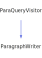

<h1>Reference</h1>

<a href="https://github.com/CharlesCarley/MdDox">~</a>
<a href="indexpage.md#mddox">MdDox</a>
/
<a href="index.md#index">Index</a>
/
<a href="namespaceMdDox.md#mddox">MdDox</a>
::
<b>Reference</b>
 
 

<h4>Derived By</h4>
<a href="classMdDox_1_1CompoundReference.md#compoundreference" class="icon-list-item">CompoundReference
</a>

 
<a href="classMdDox_1_1MemberReference.md#memberreference" class="icon-list-item">MemberReference
</a>

 
 

<h2>Protected Members</h2>
<a href="#_name" class="icon-list-item">_name
</a>

 
<a href="#_ref" class="icon-list-item">_ref
</a>

 

<h2>Public Methods</h2>
<a href="#reference" class="icon-list-item">Reference
</a>

 
<a href="#~reference" class="icon-list-item">~Reference
</a>

 
<a href="#empty" class="icon-list-item">empty
</a>

 
<a href="#getname" class="icon-list-item">getName
</a>

 
<a href="#getreference" class="icon-list-item">getReference
</a>

 
<a href="#setname" class="icon-list-item">setName
</a>

 
<a href="#setreference" class="icon-list-item">setReference
</a>

 

<h4>Defined in</h4>
<a href="https://github.com/CharlesCarley/MdDox/blob/master//Source/MdDoxTree/Reference.h#L31" class="icon-list-item">Reference.h
</a>

 

<h2>_name</h2>
<a href="namespaceMdDox.md#string">String</a>
<b>_name</b>
 

<h4>Defined in</h4>
<a href="https://github.com/CharlesCarley/MdDox/blob/master//Source/MdDoxTree/Reference.h#L33" class="icon-list-item">Reference.h
</a>

 
 

<h2>_ref</h2>
<a href="namespaceMdDox.md#string">String</a>
<b>_ref</b>
 

<h4>Defined in</h4>
<a href="https://github.com/CharlesCarley/MdDox/blob/master//Source/MdDoxTree/Reference.h#L34" class="icon-list-item">Reference.h
</a>

 
 

<h2>Reference</h2>
<b>Reference</b>
<i>(</i>
<i>)</i>

<h4>Defined in</h4>
<a href="https://github.com/CharlesCarley/MdDox/blob/master//Source/MdDoxTree/Reference.h#L37" class="icon-list-item">Reference.h
</a>

 
 

<h2>~Reference</h2>
<b>~Reference</b>
<i>(</i>
<i>)</i>

<h4>Defined in</h4>
<a href="https://github.com/CharlesCarley/MdDox/blob/master//Source/MdDoxTree/Reference.h#L38" class="icon-list-item">Reference.h
</a>

 
 

<h2>empty</h2>
bool
<b>empty</b>
<i>(</i>
<i>)</i>

<h4>References</h4>
<a href="classMdDox_1_1Reference.md#_ref" class="icon-list-item">_ref
</a>

 

<h4>Defined in</h4>
<a href="https://github.com/CharlesCarley/MdDox/blob/master//Source/MdDoxTree/Reference.h#L49" class="icon-list-item">Reference.h
</a>

 
 

<h2>getName</h2>
const 
<a href="namespaceMdDox.md#string">String</a>
 &amp;
<b>getName</b>
<i>(</i>
<i>)</i>

<h4>References</h4>
<a href="classMdDox_1_1Reference.md#_name" class="icon-list-item">_name
</a>

 

<h4>Defined in</h4>
<a href="https://github.com/CharlesCarley/MdDox/blob/master//Source/MdDoxTree/Reference.h#L40" class="icon-list-item">Reference.h
</a>

 
 

<h2>getReference</h2>
const 
<a href="namespaceMdDox.md#string">String</a>
 &amp;
<b>getReference</b>
<i>(</i>
<i>)</i>

<h4>References</h4>
<a href="classMdDox_1_1Reference.md#_ref" class="icon-list-item">_ref
</a>

 

<h4>Defined in</h4>
<a href="https://github.com/CharlesCarley/MdDox/blob/master//Source/MdDoxTree/Reference.h#L44" class="icon-list-item">Reference.h
</a>

 
 

<h2>setName</h2>
void
<b>setName</b>
<i>(</i>

const 
<a href="namespaceMdDox.md#string">String</a>
 &amp;
name

<i>)</i>

<h4>References</h4>
<a href="classMdDox_1_1Reference.md#_name" class="icon-list-item">_name
</a>

 

<h4>Defined in</h4>
<a href="https://github.com/CharlesCarley/MdDox/blob/master//Source/MdDoxTree/Reference.h#L42" class="icon-list-item">Reference.h
</a>

 
 

<h2>setReference</h2>
void
<b>setReference</b>
<i>(</i>

const 
<a href="namespaceMdDox.md#string">String</a>
 &amp;
ref

<i>)</i>

<h4>References</h4>
<a href="classMdDox_1_1Reference.md#_ref" class="icon-list-item">_ref
</a>

 

<h4>Defined in</h4>
<a href="https://github.com/CharlesCarley/MdDox/blob/master//Source/MdDoxTree/Reference.h#L46" class="icon-list-item">Reference.h
</a>

 
 
 
<blockquote>
The following sources were used to generate this page.
 
<a href="../xml/classMdDox_1_1Reference.xml#L1" class="icon-list-item">classMdDox_1_1Reference.xml
</a>

 
<a href="../xml/compound.xsd#L1" class="icon-list-item">compound.xsd
</a>

</blockquote>

</body>
</html>
