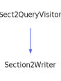

<h1>SectionDefListingWriter</h1>

<a href="https://github.com/CharlesCarley/MdDox.md">~</a>
<a href="indexpage.md#mddox">MdDox</a>
/
<a href="index.md#index">Index</a>
/
<a href="namespaceMdDox.md#mddox">MdDox</a>
::
<b>SectionDefListingWriter</b>
 
 

<h4>Derived From</h4>

<a href="classMdDox_1_1Doxygen_1_1Visitors_1_1SectionDefQueryVisitor.md#mddoxdoxygenvisitorssectiondefqueryvisitor">MdDox::Doxygen::Visitors::SectionDefQueryVisitor</a>

 

<h2>Private Members</h2>
<a href="#_depth" class="icon-list-item">_depth
</a>

 
<a href="#_out" class="icon-list-item">_out
</a>

 
<a href="#_stream" class="icon-list-item">_stream
</a>

 
<a href="#_writer" class="icon-list-item">_writer
</a>

 

<h2>Private Methods</h2>
<a href="#visiteddescription" class="icon-list-item">visitedDescription
</a>

 
<a href="#visitedheader" class="icon-list-item">visitedHeader
</a>

 
<a href="#visitedmemberdef" class="icon-list-item">visitedMemberDef
</a>

 
<a href="#writeheading" class="icon-list-item">writeHeading
</a>

 

<h2>Public Methods</h2>
<a href="#sectiondeflistingwriter" class="icon-list-item">SectionDefListingWriter
</a>

 
<a href="#setdepth" class="icon-list-item">setDepth
</a>

 
<a href="#write" class="icon-list-item">write
</a>

 

<h4>Defined in</h4>
<a href="https://github.com/CharlesCarley/MdDox/blob/master//Source/MdDoxTree/SectionDefListingWriter.h#L32" class="icon-list-item">SectionDefListingWriter.h
</a>

<h2>_depth</h2>
int
<b>_depth</b>
 

<h4>Defined in</h4>
<a href="https://github.com/CharlesCarley/MdDox/blob/master//Source/MdDoxTree/SectionDefListingWriter.h#L37" class="icon-list-item">SectionDefListingWriter.h
</a>

 

<h2>_out</h2>
<a href="namespaceMdDox.md#outputstringstream">OutputStringStream</a>
<b>_out</b>
 

<h4>Defined in</h4>
<a href="https://github.com/CharlesCarley/MdDox/blob/master//Source/MdDoxTree/SectionDefListingWriter.h#L36" class="icon-list-item">SectionDefListingWriter.h
</a>

 

<h2>_stream</h2>
<a href="namespaceMdDox.md#ostream">OStream</a>
 *
<b>_stream</b>
 

<h4>Defined in</h4>
<a href="https://github.com/CharlesCarley/MdDox/blob/master//Source/MdDoxTree/SectionDefListingWriter.h#L35" class="icon-list-item">SectionDefListingWriter.h
</a>

 

<h2>_writer</h2>
<a href="classMdDox_1_1DocumentWriter.md#documentwriter">DocumentWriter</a>
 *
<b>_writer</b>
 

<h4>Defined in</h4>
<a href="https://github.com/CharlesCarley/MdDox/blob/master//Source/MdDoxTree/SectionDefListingWriter.h#L34" class="icon-list-item">SectionDefListingWriter.h
</a>

 

<h2>visitedDescription</h2>
void
<b>visitedDescription</b>
<i>(</i>

const 
<a href="classMdDox_1_1Doxygen_1_1DescriptionQuery.md#doxygendescriptionquery">Doxygen::DescriptionQuery</a>
 &amp;
query

<i>)</i>

<h4>Details</h4>
Called when the element 
<b>description</b>
 is found. 
 
 
<ul>
<li><b>query</b>
 - 
Const reference to the DescriptionQuery class. 
</li>
</ul>
 

<h4>Defined in</h4>
<a href="https://github.com/CharlesCarley/MdDox/blob/master//Source/MdDoxTree/SectionDefListingWriter.h#L41" class="icon-list-item">SectionDefListingWriter.h
</a>

 
<a href="https://github.com/CharlesCarley/MdDox/blob/master//Source/MdDoxTree/SectionDefListingWriter.cpp#L48" class="icon-list-item">SectionDefListingWriter.cpp
</a>

 

<h2>visitedHeader</h2>
void
<b>visitedHeader</b>
<i>(</i>

const 
<a href="namespaceMdDox.md#string">String</a>
 &amp;
text

<i>)</i>

<h4>Details</h4>
Called when the element 
<b>header</b>
 is found. 
 
 
<ul>
<li><b>text</b>
 - 
Const reference to the internal text. 
</li>
</ul>
 

<h4>Defined in</h4>
<a href="https://github.com/CharlesCarley/MdDox/blob/master//Source/MdDoxTree/SectionDefListingWriter.h#L43" class="icon-list-item">SectionDefListingWriter.h
</a>

 
<a href="https://github.com/CharlesCarley/MdDox/blob/master//Source/MdDoxTree/SectionDefListingWriter.cpp#L53" class="icon-list-item">SectionDefListingWriter.cpp
</a>

 

<h2>visitedMemberDef</h2>
void
<b>visitedMemberDef</b>
<i>(</i>

const 
<a href="classMdDox_1_1Doxygen_1_1MemberDefQuery.md#doxygenmemberdefquery">Doxygen::MemberDefQuery</a>
 &amp;
query

<i>)</i>

<h4>Details</h4>
Called when the element 
<b>memberdef</b>
 is found. 
 
 
<ul>
<li><b>query</b>
 - 
Const reference to the MemberDefQuery class. 
</li>
</ul>
 

<h4>Defined in</h4>
<a href="https://github.com/CharlesCarley/MdDox/blob/master//Source/MdDoxTree/SectionDefListingWriter.h#L39" class="icon-list-item">SectionDefListingWriter.h
</a>

 
<a href="https://github.com/CharlesCarley/MdDox/blob/master//Source/MdDoxTree/SectionDefListingWriter.cpp#L42" class="icon-list-item">SectionDefListingWriter.cpp
</a>

 

<h2>writeHeading</h2>
void
<b>writeHeading</b>
<i>(</i>

<a href="namespaceMdDox_1_1Doxygen.md#doxygendoxsectionkindenum">Doxygen::DoxSectionKindEnum</a>
kind

<i>)</i>

<h4>Defined in</h4>
<a href="https://github.com/CharlesCarley/MdDox/blob/master//Source/MdDoxTree/SectionDefListingWriter.h#L45" class="icon-list-item">SectionDefListingWriter.h
</a>

 
<a href="https://github.com/CharlesCarley/MdDox/blob/master//Source/MdDoxTree/SectionDefListingWriter.cpp#L58" class="icon-list-item">SectionDefListingWriter.cpp
</a>

 

<h2>SectionDefListingWriter</h2>
<b>SectionDefListingWriter</b>
<i>(</i>

<a href="classMdDox_1_1DocumentWriter.md#documentwriter">DocumentWriter</a>
 *
writer

<a href="namespaceMdDox.md#ostream">OStream</a>
 *
out

<i>)</i>

<h4>Defined in</h4>
<a href="https://github.com/CharlesCarley/MdDox/blob/master//Source/MdDoxTree/SectionDefListingWriter.h#L48" class="icon-list-item">SectionDefListingWriter.h
</a>

 
<a href="https://github.com/CharlesCarley/MdDox/blob/master//Source/MdDoxTree/SectionDefListingWriter.cpp#L30" class="icon-list-item">SectionDefListingWriter.cpp
</a>

 

<h2>setDepth</h2>
void
<b>setDepth</b>
<i>(</i>

int
depth

<i>)</i>

<h4>Defined in</h4>
<a href="https://github.com/CharlesCarley/MdDox/blob/master//Source/MdDoxTree/SectionDefListingWriter.h#L50" class="icon-list-item">SectionDefListingWriter.h
</a>

 
<a href="https://github.com/CharlesCarley/MdDox/blob/master//Source/MdDoxTree/SectionDefListingWriter.cpp#L37" class="icon-list-item">SectionDefListingWriter.cpp
</a>

 

<h2>write</h2>
bool
<b>write</b>
<i>(</i>

const 
<a href="classMdDox_1_1Doxygen_1_1SectionDefQuery.md#doxygensectiondefquery">Doxygen::SectionDefQuery</a>
 &amp;
sec

<i>)</i>

<h4>References</h4>

<a href="classMdDox_1_1Doxygen_1_1Query.md#isvalid">isValid</a>

<a href="classMdDox_1_1Doxygen_1_1SectionDefQuery.md#getkind">getKind</a>

<a href="namespaceMdDox_1_1Doxygen.md#doxheader">DoxHeader</a>

<a href="namespaceMdDox_1_1Doxygen.md#doxdescription">DoxDescription</a>

<a href="namespaceMdDox_1_1Doxygen.md#doxmemberdef">DoxMemberDef</a>

<a href="classMdDox_1_1Doxygen_1_1Query.md#sort">sort</a>

<a href="classMdDox_1_1Doxygen_1_1SectionDefQuery.md#visit">visit</a>

<a href="namespaceMdDox.md#syncstream">syncStream</a>

<h4>Defined in</h4>
<a href="https://github.com/CharlesCarley/MdDox/blob/master//Source/MdDoxTree/SectionDefListingWriter.h#L51" class="icon-list-item">SectionDefListingWriter.h
</a>

 
<a href="https://github.com/CharlesCarley/MdDox/blob/master//Source/MdDoxTree/SectionDefListingWriter.cpp#L178" class="icon-list-item">SectionDefListingWriter.cpp
</a>

 

</body>
</html>
