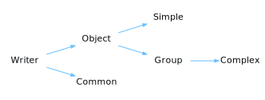

<a id="node"></a>
<h1>Node</h1>
<a id="classMdDox_1_1Xml_1_1Node"></a>
<a href="https://github.com/CharlesCarley/MdDox">~</a>
<a href="indexpage.md#index">Index</a>
<span class="inline-text">/</span>
<a href="index.md#mddox">MdDox</a>
<span class="inline-text">/</span>
<a href="namespaceMdDox.md#">MdDox</a>
<span class="inline-text">::</span>
<a href="dir_19b9d1dd05713e515e11a6d5d9c80351.md#">Source/Xml</a>
<span class="inline-text">::</span>
<span class="bold-text"><b>Node</b></span>
<br/>
<br/>
<span class="inline-text">Provides a tree structure to contain an XML document. </span>
<br/>
<br/>
<a id="derived-by"></a>
<h4>Derived By</h4>
<span class="icon-list-item"><a href="classMdDox_1_1LocalNode.md#localnode" class="icon-list-item"><span class="icon-list-item">LocalNode</span>
</a>
</span>
<br/>
<br/>
<a id="private-members"></a>
<h2>Private Members</h2>
<span class="icon-list-item"><a href="#_attributes" class="icon-list-item"><span class="icon-list-item">_attributes</span>
</a>
</span>
<br/>
<span class="icon-list-item"><a href="#_children" class="icon-list-item"><span class="icon-list-item">_children</span>
</a>
</span>
<br/>
<span class="icon-list-item"><a href="#_name" class="icon-list-item"><span class="icon-list-item">_name</span>
</a>
</span>
<br/>
<span class="icon-list-item"><a href="#_next" class="icon-list-item"><span class="icon-list-item">_next</span>
</a>
</span>
<br/>
<span class="icon-list-item"><a href="#_parent" class="icon-list-item"><span class="icon-list-item">_parent</span>
</a>
</span>
<br/>
<span class="icon-list-item"><a href="#_text" class="icon-list-item"><span class="icon-list-item">_text</span>
</a>
</span>
<br/>
<span class="icon-list-item"><a href="#_typecode" class="icon-list-item"><span class="icon-list-item">_typeCode</span>
</a>
</span>
<br/>
<a id="protected-members"></a>
<h2>Protected Members</h2>
<span class="icon-list-item"><a href="#_autodelete" class="icon-list-item"><span class="icon-list-item">_autoDelete</span>
</a>
</span>
<br/>
<a id="public-methods"></a>
<h2>Public Methods</h2>
<span class="icon-list-item"><a href="#node" class="icon-list-item"><span class="icon-list-item">Node</span>
</a>
</span>
<br/>
<span class="icon-list-item"><a href="#node" class="icon-list-item"><span class="icon-list-item">Node</span>
</a>
</span>
<br/>
<span class="icon-list-item"><a href="#~node" class="icon-list-item"><span class="icon-list-item">~Node</span>
</a>
</span>
<br/>
<span class="icon-list-item"><a href="#addchild" class="icon-list-item"><span class="icon-list-item">addChild</span>
</a>
</span>
<br/>
<span class="icon-list-item"><a href="#at" class="icon-list-item"><span class="icon-list-item">at</span>
</a>
</span>
<br/>
<span class="icon-list-item"><a href="#at" class="icon-list-item"><span class="icon-list-item">at</span>
</a>
</span>
<br/>
<span class="icon-list-item"><a href="#attribute" class="icon-list-item"><span class="icon-list-item">attribute</span>
</a>
</span>
<br/>
<span class="icon-list-item"><a href="#attributes" class="icon-list-item"><span class="icon-list-item">attributes</span>
</a>
</span>
<br/>
<span class="icon-list-item"><a href="#children" class="icon-list-item"><span class="icon-list-item">children</span>
</a>
</span>
<br/>
<span class="icon-list-item"><a href="#contains" class="icon-list-item"><span class="icon-list-item">contains</span>
</a>
</span>
<br/>
<span class="icon-list-item"><a href="#firstchild" class="icon-list-item"><span class="icon-list-item">firstChild</span>
</a>
</span>
<br/>
<span class="icon-list-item"><a href="#firstchildof" class="icon-list-item"><span class="icon-list-item">firstChildOf</span>
</a>
</span>
<br/>
<span class="icon-list-item"><a href="#firstchildof" class="icon-list-item"><span class="icon-list-item">firstChildOf</span>
</a>
</span>
<br/>
<span class="icon-list-item"><a href="#get" class="icon-list-item"><span class="icon-list-item">get</span>
</a>
</span>
<br/>
<span class="icon-list-item"><a href="#getfirstchild" class="icon-list-item"><span class="icon-list-item">getFirstChild</span>
</a>
</span>
<br/>
<span class="icon-list-item"><a href="#getfirstchild" class="icon-list-item"><span class="icon-list-item">getFirstChild</span>
</a>
</span>
<br/>
<span class="icon-list-item"><a href="#gettypecode" class="icon-list-item"><span class="icon-list-item">getTypeCode</span>
</a>
</span>
<br/>
<span class="icon-list-item"><a href="#hasattributes" class="icon-list-item"><span class="icon-list-item">hasAttributes</span>
</a>
</span>
<br/>
<span class="icon-list-item"><a href="#haschild" class="icon-list-item"><span class="icon-list-item">hasChild</span>
</a>
</span>
<br/>
<span class="icon-list-item"><a href="#haschildren" class="icon-list-item"><span class="icon-list-item">hasChildren</span>
</a>
</span>
<br/>
<span class="icon-list-item"><a href="#hastext" class="icon-list-item"><span class="icon-list-item">hasText</span>
</a>
</span>
<br/>
<span class="icon-list-item"><a href="#insert" class="icon-list-item"><span class="icon-list-item">insert</span>
</a>
</span>
<br/>
<span class="icon-list-item"><a href="#integer" class="icon-list-item"><span class="icon-list-item">integer</span>
</a>
</span>
<br/>
<span class="icon-list-item"><a href="#istypeof" class="icon-list-item"><span class="icon-list-item">isTypeOf</span>
</a>
</span>
<br/>
<span class="icon-list-item"><a href="#istypeof" class="icon-list-item"><span class="icon-list-item">isTypeOf</span>
</a>
</span>
<br/>
<span class="icon-list-item"><a href="#name" class="icon-list-item"><span class="icon-list-item">name</span>
</a>
</span>
<br/>
<span class="icon-list-item"><a href="#nextsiblingof" class="icon-list-item"><span class="icon-list-item">nextSiblingOf</span>
</a>
</span>
<br/>
<span class="icon-list-item"><a href="#nextsiblingof" class="icon-list-item"><span class="icon-list-item">nextSiblingOf</span>
</a>
</span>
<br/>
<span class="icon-list-item"><a href="#parent" class="icon-list-item"><span class="icon-list-item">parent</span>
</a>
</span>
<br/>
<span class="icon-list-item"><a href="#settypecode" class="icon-list-item"><span class="icon-list-item">setTypeCode</span>
</a>
</span>
<br/>
<span class="icon-list-item"><a href="#siblingsof" class="icon-list-item"><span class="icon-list-item">siblingsOf</span>
</a>
</span>
<br/>
<span class="icon-list-item"><a href="#size" class="icon-list-item"><span class="icon-list-item">size</span>
</a>
</span>
<br/>
<span class="icon-list-item"><a href="#sort" class="icon-list-item"><span class="icon-list-item">sort</span>
</a>
</span>
<br/>
<span class="icon-list-item"><a href="#text" class="icon-list-item"><span class="icon-list-item">text</span>
</a>
</span>
<br/>
<span class="icon-list-item"><a href="#text" class="icon-list-item"><span class="icon-list-item">text</span>
</a>
</span>
<br/>
<a id="details"></a>
<h2>Details</h2>
<span class="inline-text">A </span>
<a href="classMdDox_1_1Xml_1_1Node.md#node">Node</a>
<span class="inline-text"> represents a single XML tag.</span>
<span class="inline-text">A single node in the tree can have one parent and (N) number of children.</span>
<span class="inline-text">Each node may contain any number of attributes attached to it.</span>
<span class="inline-text">Any node can optionally have plain-text data associated with it. In order to keep the internal text inline with tag based nodes, the parser creates a specialty node with the name </span>
<span class="bold-text"><b>_text_node</b></span>
<span class="inline-text"> to store blocks of text in between tags. The text node is pushed as a child node to the node on the top of the parse stack.</span>
<span class="inline-text">All attributes are defined in the form of a string. Any extra type of serialization is beyond the scope of this class and must be handled elsewhere. There is, however, one exception to this if a type filter has been applied before parsing the file, an optional type code can be assigned to the node itself so that nodes can be type-checked with integers VS strings. </span>
<br/>
<br/>
<a id="defined-in"></a>
<h4>Defined in</h4>
<span class="icon-list-item"><a href="https://github.com/CharlesCarley/MdDox/blob/master//Source/Xml/Node.h#L74" class="icon-list-item"><span class="icon-list-item">Node.h</span>
</a>
</span>
<br/>
<a id="_attributes"></a>
<h2>_attributes</h2>
<a href="namespaceMdDox_1_1Xml.md#attributemap">AttributeMap</a>
<span class="bold-text"><b>_attributes</b></span>
<br/>
<a id="defined-in"></a>
<h4>Defined in</h4>
<span class="icon-list-item"><a href="https://github.com/CharlesCarley/MdDox/blob/master//Source/Xml/Node.h#L79" class="icon-list-item"><span class="icon-list-item">Node.h</span>
</a>
</span>
<br/>
<br/>
<a id="_children"></a>
<h2>_children</h2>
<a href="namespaceMdDox_1_1Xml.md#nodearray">NodeArray</a>
<span class="bold-text"><b>_children</b></span>
<br/>
<a id="defined-in"></a>
<h4>Defined in</h4>
<span class="icon-list-item"><a href="https://github.com/CharlesCarley/MdDox/blob/master//Source/Xml/Node.h#L82" class="icon-list-item"><span class="icon-list-item">Node.h</span>
</a>
</span>
<br/>
<br/>
<a id="_name"></a>
<h2>_name</h2>
<a href="namespaceMdDox.md#string">String</a>
<span class="bold-text"><b>_name</b></span>
<br/>
<a id="defined-in"></a>
<h4>Defined in</h4>
<span class="icon-list-item"><a href="https://github.com/CharlesCarley/MdDox/blob/master//Source/Xml/Node.h#L76" class="icon-list-item"><span class="icon-list-item">Node.h</span>
</a>
</span>
<br/>
<br/>
<a id="_next"></a>
<h2>_next</h2>
<a href="classMdDox_1_1Xml_1_1Node.md#node">Node</a>
<span class="inline-text"> *</span>
<span class="bold-text"><b>_next</b></span>
<br/>
<a id="defined-in"></a>
<h4>Defined in</h4>
<span class="icon-list-item"><a href="https://github.com/CharlesCarley/MdDox/blob/master//Source/Xml/Node.h#L81" class="icon-list-item"><span class="icon-list-item">Node.h</span>
</a>
</span>
<br/>
<br/>
<a id="_parent"></a>
<h2>_parent</h2>
<a href="classMdDox_1_1Xml_1_1Node.md#node">Node</a>
<span class="inline-text"> *</span>
<span class="bold-text"><b>_parent</b></span>
<br/>
<a id="defined-in"></a>
<h4>Defined in</h4>
<span class="icon-list-item"><a href="https://github.com/CharlesCarley/MdDox/blob/master//Source/Xml/Node.h#L80" class="icon-list-item"><span class="icon-list-item">Node.h</span>
</a>
</span>
<br/>
<br/>
<a id="_text"></a>
<h2>_text</h2>
<a href="namespaceMdDox.md#string">String</a>
<span class="bold-text"><b>_text</b></span>
<br/>
<a id="defined-in"></a>
<h4>Defined in</h4>
<span class="icon-list-item"><a href="https://github.com/CharlesCarley/MdDox/blob/master//Source/Xml/Node.h#L77" class="icon-list-item"><span class="icon-list-item">Node.h</span>
</a>
</span>
<br/>
<br/>
<a id="_typecode"></a>
<h2>_typeCode</h2>
<span class="inline-text">int64_t</span>
<span class="bold-text"><b>_typeCode</b></span>
<br/>
<a id="defined-in"></a>
<h4>Defined in</h4>
<span class="icon-list-item"><a href="https://github.com/CharlesCarley/MdDox/blob/master//Source/Xml/Node.h#L78" class="icon-list-item"><span class="icon-list-item">Node.h</span>
</a>
</span>
<br/>
<br/>
<a id="_autodelete"></a>
<h2>_autoDelete</h2>
<span class="inline-text">bool</span>
<span class="bold-text"><b>_autoDelete</b></span>
<br/>
<a id="defined-in"></a>
<h4>Defined in</h4>
<span class="icon-list-item"><a href="https://github.com/CharlesCarley/MdDox/blob/master//Source/Xml/Node.h#L85" class="icon-list-item"><span class="icon-list-item">Node.h</span>
</a>
</span>
<br/>
<br/>
<a id="node"></a>
<h2>Node</h2>
<span class="bold-text"><b>Node</b></span>
<span class="italic-text"><i>(</i></span>
<span class="italic-text"><i>)</i></span>
<a id="details"></a>
<h4>Details</h4>
<span class="inline-text">Default constructor. </span>
<br/>
<br/>
<a id="defined-in"></a>
<h4>Defined in</h4>
<span class="icon-list-item"><a href="https://github.com/CharlesCarley/MdDox/blob/master//Source/Xml/Node.h#L91" class="icon-list-item"><span class="icon-list-item">Node.h</span>
</a>
</span>
<br/>
<span class="icon-list-item"><a href="https://github.com/CharlesCarley/MdDox/blob/master//Source/Xml/Node.cpp#L32" class="icon-list-item"><span class="icon-list-item">Node.cpp</span>
</a>
</span>
<br/>
<br/>
<a id="node"></a>
<h2>Node</h2>
<span class="bold-text"><b>Node</b></span>
<span class="italic-text"><i>(</i></span>
<div class="paragraph">
<span class="paragraph"><a href="namespaceMdDox.md#string">String</a>
<span class="inline-text">name</span>
</span>
</div>
<span class="italic-text"><i>)</i></span>
<a id="details"></a>
<h4>Details</h4>
<span class="inline-text">Constructs a node with a name. </span>
<br/>
<br/>
<ul>
<li><span class="bold-text"><b>name</b></span>
<span class="inline-text"> - </span>
<span class="inline-text">The name to associate with this node. </span>
</li>
</ul>
<br/>
<a id="defined-in"></a>
<h4>Defined in</h4>
<span class="icon-list-item"><a href="https://github.com/CharlesCarley/MdDox/blob/master//Source/Xml/Node.h#L97" class="icon-list-item"><span class="icon-list-item">Node.h</span>
</a>
</span>
<br/>
<span class="icon-list-item"><a href="https://github.com/CharlesCarley/MdDox/blob/master//Source/Xml/Node.cpp#L40" class="icon-list-item"><span class="icon-list-item">Node.cpp</span>
</a>
</span>
<br/>
<br/>
<a id="~node"></a>
<h2>~Node</h2>
<span class="bold-text"><b>~Node</b></span>
<span class="italic-text"><i>(</i></span>
<span class="italic-text"><i>)</i></span>
<a id="details"></a>
<h4>Details</h4>
<span class="inline-text">Default destructor. </span>
<br/>
<br/>
<span class="inline-text">Deletes all child nodes. </span>
<br/>
<a id="references"></a>
<h4>References</h4>
<span class="icon-list-item"><a href="classMdDox_1_1Xml_1_1Node.md#_autodelete" class="icon-list-item"><span class="icon-list-item">_autoDelete</span>
</a>
</span>
<br/>
<a id="defined-in"></a>
<h4>Defined in</h4>
<span class="icon-list-item"><a href="https://github.com/CharlesCarley/MdDox/blob/master//Source/Xml/Node.h#L104" class="icon-list-item"><span class="icon-list-item">Node.h</span>
</a>
</span>
<br/>
<span class="icon-list-item"><a href="https://github.com/CharlesCarley/MdDox/blob/master//Source/Xml/Node.cpp#L49" class="icon-list-item"><span class="icon-list-item">Node.cpp</span>
</a>
</span>
<br/>
<br/>
<a id="addchild"></a>
<h2>addChild</h2>
<span class="inline-text">void</span>
<span class="bold-text"><b>addChild</b></span>
<span class="italic-text"><i>(</i></span>
<div class="paragraph">
<span class="paragraph"><a href="classMdDox_1_1Xml_1_1Node.md#node">Node</a>
<span class="inline-text"> *</span>
<span class="inline-text">child</span>
</span>
</div>
<span class="italic-text"><i>)</i></span>
<a id="details"></a>
<h4>Details</h4>
<span class="inline-text">Appends a child node to the current list of children, and sets the child node&apos;s parent to the current instance. </span>
<br/>
<br/>
<ul>
<li><span class="bold-text"><b>child</b></span>
<span class="inline-text"> - </span>
<span class="inline-text">The node to append. </span>
</li>
</ul>
<br/>
<a id="defined-in"></a>
<h4>Defined in</h4>
<span class="icon-list-item"><a href="https://github.com/CharlesCarley/MdDox/blob/master//Source/Xml/Node.h#L111" class="icon-list-item"><span class="icon-list-item">Node.h</span>
</a>
</span>
<br/>
<span class="icon-list-item"><a href="https://github.com/CharlesCarley/MdDox/blob/master//Source/Xml/Node.cpp#L58" class="icon-list-item"><span class="icon-list-item">Node.cpp</span>
</a>
</span>
<br/>
<br/>
<a id="at"></a>
<h2>at</h2>
<a href="classMdDox_1_1Xml_1_1Node.md#node">Node</a>
<span class="inline-text"> *</span>
<span class="bold-text"><b>at</b></span>
<span class="italic-text"><i>(</i></span>
<div class="paragraph">
<span class="paragraph"><span class="inline-text">const size_t &amp;</span>
<span class="inline-text">idx</span>
</span>
</div>
<span class="italic-text"><i>)</i></span>
<a id="details"></a>
<h4>Details</h4>
<span class="inline-text">Provides access to the child node at the supplied index. </span>
<br/>
<br/>
<ul>
<li><span class="bold-text"><b>idx</b></span>
<span class="inline-text"> - </span>
<span class="inline-text">The index of the child node. </span>
</li>
</ul>
<a id="returns"></a>
<h4>Returns</h4>
<span class="inline-text">The node at the supplied index. </span>
<br/>
<br/>
<a id="defined-in"></a>
<h4>Defined in</h4>
<span class="icon-list-item"><a href="https://github.com/CharlesCarley/MdDox/blob/master//Source/Xml/Node.h#L124" class="icon-list-item"><span class="icon-list-item">Node.h</span>
</a>
</span>
<br/>
<span class="icon-list-item"><a href="https://github.com/CharlesCarley/MdDox/blob/master//Source/Xml/Node.cpp#L71" class="icon-list-item"><span class="icon-list-item">Node.cpp</span>
</a>
</span>
<br/>
<br/>
<a id="at"></a>
<h2>at</h2>
<span class="inline-text">const </span>
<a href="classMdDox_1_1Xml_1_1Node.md#node">Node</a>
<span class="inline-text"> *</span>
<span class="bold-text"><b>at</b></span>
<span class="italic-text"><i>(</i></span>
<div class="paragraph">
<span class="paragraph"><span class="inline-text">const size_t &amp;</span>
<span class="inline-text">idx</span>
</span>
</div>
<span class="italic-text"><i>)</i></span>
<a id="details"></a>
<h4>Details</h4>
<span class="inline-text">Provides access to the child node at the supplied index. </span>
<br/>
<br/>
<ul>
<li><span class="bold-text"><b>idx</b></span>
<span class="inline-text"> - </span>
<span class="inline-text">The index of the child node. </span>
</li>
</ul>
<a id="returns"></a>
<h4>Returns</h4>
<span class="inline-text">The node at the supplied index. </span>
<br/>
<br/>
<a id="defined-in"></a>
<h4>Defined in</h4>
<span class="icon-list-item"><a href="https://github.com/CharlesCarley/MdDox/blob/master//Source/Xml/Node.h#L129" class="icon-list-item"><span class="icon-list-item">Node.h</span>
</a>
</span>
<br/>
<span class="icon-list-item"><a href="https://github.com/CharlesCarley/MdDox/blob/master//Source/Xml/Node.cpp#L79" class="icon-list-item"><span class="icon-list-item">Node.cpp</span>
</a>
</span>
<br/>
<br/>
<a id="attribute"></a>
<h2>attribute</h2>
<span class="inline-text">const </span>
<a href="namespaceMdDox.md#string">String</a>
<span class="inline-text"> &amp;</span>
<span class="bold-text"><b>attribute</b></span>
<span class="italic-text"><i>(</i></span>
<div class="paragraph">
<span class="paragraph"><span class="inline-text">const </span>
<a href="namespaceMdDox.md#string">String</a>
<span class="inline-text"> &amp;</span>
<span class="inline-text">name</span>
</span>
</div>
<div class="paragraph">
<span class="paragraph"><span class="inline-text">const </span>
<a href="namespaceMdDox.md#string">String</a>
<span class="inline-text"> &amp;</span>
<span class="inline-text">def</span>
<span class="inline-text"> = </span>
<span class="inline-text">&quot;&quot;</span>
</span>
</div>
<span class="italic-text"><i>)</i></span>
<a id="details"></a>
<h4>Details</h4>
<span class="inline-text">Looks up the supplied name in the attribute map. </span>
<br/>
<br/>
<ul>
<li><span class="bold-text"><b>name</b></span>
<span class="inline-text"> - </span>
<span class="inline-text">The search term </span>
</li>
<li><span class="bold-text"><b>def</b></span>
<span class="inline-text"> - </span>
<span class="inline-text">The default value if the search fails. </span>
</li>
</ul>
<a id="returns"></a>
<h4>Returns</h4>
<span class="inline-text">The found attribute value on success, otherwise returns the default value. </span>
<br/>
<br/>
<a id="references"></a>
<h4>References</h4>
<span class="icon-list-item"><a href="classMdDox_1_1Xml_1_1Node.md#name" class="icon-list-item"><span class="icon-list-item">name</span>
</a>
</span>
<br/>
<a id="defined-in"></a>
<h4>Defined in</h4>
<span class="icon-list-item"><a href="https://github.com/CharlesCarley/MdDox/blob/master//Source/Xml/Node.h#L224" class="icon-list-item"><span class="icon-list-item">Node.h</span>
</a>
</span>
<br/>
<span class="icon-list-item"><a href="https://github.com/CharlesCarley/MdDox/blob/master//Source/Xml/Node.cpp#L109" class="icon-list-item"><span class="icon-list-item">Node.cpp</span>
</a>
</span>
<br/>
<br/>
<a id="attributes"></a>
<h2>attributes</h2>
<span class="inline-text">const </span>
<a href="namespaceMdDox_1_1Xml.md#attributemap">AttributeMap</a>
<span class="inline-text"> &amp;</span>
<span class="bold-text"><b>attributes</b></span>
<span class="italic-text"><i>(</i></span>
<span class="italic-text"><i>)</i></span>
<a id="defined-in"></a>
<h4>Defined in</h4>
<span class="icon-list-item"><a href="https://github.com/CharlesCarley/MdDox/blob/master//Source/Xml/Node.h#L191" class="icon-list-item"><span class="icon-list-item">Node.h</span>
</a>
</span>
<br/>
<br/>
<a id="children"></a>
<h2>children</h2>
<span class="inline-text">const </span>
<a href="namespaceMdDox_1_1Xml.md#nodearray">NodeArray</a>
<span class="inline-text"> &amp;</span>
<span class="bold-text"><b>children</b></span>
<span class="italic-text"><i>(</i></span>
<span class="italic-text"><i>)</i></span>
<a id="details"></a>
<h4>Details</h4>
<span class="inline-text">Provides access to the array of child nodes attached to this node. </span>
<br/>
<br/>
<a id="returns"></a>
<h4>Returns</h4>
<span class="inline-text">Const access to the array of children. </span>
<br/>
<br/>
<a id="defined-in"></a>
<h4>Defined in</h4>
<span class="icon-list-item"><a href="https://github.com/CharlesCarley/MdDox/blob/master//Source/Xml/Node.h#L117" class="icon-list-item"><span class="icon-list-item">Node.h</span>
</a>
</span>
<br/>
<br/>
<a id="contains"></a>
<h2>contains</h2>
<span class="inline-text">bool</span>
<span class="bold-text"><b>contains</b></span>
<span class="italic-text"><i>(</i></span>
<div class="paragraph">
<span class="paragraph"><span class="inline-text">const </span>
<a href="namespaceMdDox.md#string">String</a>
<span class="inline-text"> &amp;</span>
<span class="inline-text">attribute</span>
</span>
</div>
<span class="italic-text"><i>)</i></span>
<a id="references"></a>
<h4>References</h4>
<span class="icon-list-item"><a href="classMdDox_1_1Xml_1_1Node.md#attribute" class="icon-list-item"><span class="icon-list-item">attribute</span>
</a>
</span>
<br/>
<a id="defined-in"></a>
<h4>Defined in</h4>
<span class="icon-list-item"><a href="https://github.com/CharlesCarley/MdDox/blob/master//Source/Xml/Node.h#L193" class="icon-list-item"><span class="icon-list-item">Node.h</span>
</a>
</span>
<br/>
<span class="icon-list-item"><a href="https://github.com/CharlesCarley/MdDox/blob/master//Source/Xml/Node.cpp#L87" class="icon-list-item"><span class="icon-list-item">Node.cpp</span>
</a>
</span>
<br/>
<br/>
<a id="firstchild"></a>
<h2>firstChild</h2>
<span class="inline-text">const </span>
<a href="classMdDox_1_1Xml_1_1Node.md#node">Node</a>
<span class="inline-text"> &amp;</span>
<span class="bold-text"><b>firstChild</b></span>
<span class="italic-text"><i>(</i></span>
<span class="italic-text"><i>)</i></span>
<a id="details"></a>
<h4>Details</h4>
<a id="returns"></a>
<h4>Returns</h4>
<span class="inline-text">a const reference to the first element in the _children vector </span>
<br/>
<br/>
<a id="defined-in"></a>
<h4>Defined in</h4>
<span class="icon-list-item"><a href="https://github.com/CharlesCarley/MdDox/blob/master//Source/Xml/Node.h#L204" class="icon-list-item"><span class="icon-list-item">Node.h</span>
</a>
</span>
<br/>
<span class="icon-list-item"><a href="https://github.com/CharlesCarley/MdDox/blob/master//Source/Xml/Node.cpp#L177" class="icon-list-item"><span class="icon-list-item">Node.cpp</span>
</a>
</span>
<br/>
<br/>
<a id="firstchildof"></a>
<h2>firstChildOf</h2>
<a href="classMdDox_1_1Xml_1_1Node.md#node">Node</a>
<span class="inline-text"> *</span>
<span class="bold-text"><b>firstChildOf</b></span>
<span class="italic-text"><i>(</i></span>
<div class="paragraph">
<span class="paragraph"><span class="inline-text">const </span>
<a href="namespaceMdDox.md#string">String</a>
<span class="inline-text"> &amp;</span>
<span class="inline-text">tag</span>
</span>
</div>
<span class="italic-text"><i>)</i></span>
<a id="defined-in"></a>
<h4>Defined in</h4>
<span class="icon-list-item"><a href="https://github.com/CharlesCarley/MdDox/blob/master//Source/Xml/Node.h#L210" class="icon-list-item"><span class="icon-list-item">Node.h</span>
</a>
</span>
<br/>
<span class="icon-list-item"><a href="https://github.com/CharlesCarley/MdDox/blob/master//Source/Xml/Node.cpp#L231" class="icon-list-item"><span class="icon-list-item">Node.cpp</span>
</a>
</span>
<br/>
<br/>
<a id="firstchildof"></a>
<h2>firstChildOf</h2>
<a href="classMdDox_1_1Xml_1_1Node.md#node">Node</a>
<span class="inline-text"> *</span>
<span class="bold-text"><b>firstChildOf</b></span>
<span class="italic-text"><i>(</i></span>
<div class="paragraph">
<span class="paragraph"><span class="inline-text">const int64_t &amp;</span>
<span class="inline-text">tag</span>
</span>
</div>
<span class="italic-text"><i>)</i></span>
<a id="defined-in"></a>
<h4>Defined in</h4>
<span class="icon-list-item"><a href="https://github.com/CharlesCarley/MdDox/blob/master//Source/Xml/Node.h#L212" class="icon-list-item"><span class="icon-list-item">Node.h</span>
</a>
</span>
<br/>
<span class="icon-list-item"><a href="https://github.com/CharlesCarley/MdDox/blob/master//Source/Xml/Node.cpp#L244" class="icon-list-item"><span class="icon-list-item">Node.cpp</span>
</a>
</span>
<br/>
<br/>
<a id="get"></a>
<h2>get</h2>
<span class="inline-text">const </span>
<a href="namespaceMdDox.md#string">String</a>
<span class="inline-text"> &amp;</span>
<span class="bold-text"><b>get</b></span>
<span class="italic-text"><i>(</i></span>
<div class="paragraph">
<span class="paragraph"><span class="inline-text">const </span>
<a href="namespaceMdDox.md#string">String</a>
<span class="inline-text"> &amp;</span>
<span class="inline-text">attribute</span>
</span>
</div>
<span class="italic-text"><i>)</i></span>
<a id="references"></a>
<h4>References</h4>
<span class="icon-list-item"><a href="classMdDox_1_1Xml_1_1Node.md#attribute" class="icon-list-item"><span class="icon-list-item">attribute</span>
</a>
</span>
<br/>
<a id="defined-in"></a>
<h4>Defined in</h4>
<span class="icon-list-item"><a href="https://github.com/CharlesCarley/MdDox/blob/master//Source/Xml/Node.h#L197" class="icon-list-item"><span class="icon-list-item">Node.h</span>
</a>
</span>
<br/>
<span class="icon-list-item"><a href="https://github.com/CharlesCarley/MdDox/blob/master//Source/Xml/Node.cpp#L100" class="icon-list-item"><span class="icon-list-item">Node.cpp</span>
</a>
</span>
<br/>
<br/>
<a id="getfirstchild"></a>
<h2>getFirstChild</h2>
<a href="classMdDox_1_1Xml_1_1Node.md#node">Node</a>
<span class="inline-text"> *</span>
<span class="bold-text"><b>getFirstChild</b></span>
<span class="italic-text"><i>(</i></span>
<div class="paragraph">
<span class="paragraph"><span class="inline-text">const </span>
<a href="namespaceMdDox.md#string">String</a>
<span class="inline-text"> &amp;</span>
<span class="inline-text">requireType</span>
</span>
</div>
<span class="italic-text"><i>)</i></span>
<a id="references"></a>
<h4>References</h4>
<span class="icon-list-item"><a href="classMdDox_1_1Xml_1_1Node.md#name" class="icon-list-item"><span class="icon-list-item">name</span>
</a>
</span>
<br/>
<a id="defined-in"></a>
<h4>Defined in</h4>
<span class="icon-list-item"><a href="https://github.com/CharlesCarley/MdDox/blob/master//Source/Xml/Node.h#L206" class="icon-list-item"><span class="icon-list-item">Node.h</span>
</a>
</span>
<br/>
<span class="icon-list-item"><a href="https://github.com/CharlesCarley/MdDox/blob/master//Source/Xml/Node.cpp#L184" class="icon-list-item"><span class="icon-list-item">Node.cpp</span>
</a>
</span>
<br/>
<br/>
<a id="getfirstchild"></a>
<h2>getFirstChild</h2>
<a href="classMdDox_1_1Xml_1_1Node.md#node">Node</a>
<span class="inline-text"> *</span>
<span class="bold-text"><b>getFirstChild</b></span>
<span class="italic-text"><i>(</i></span>
<div class="paragraph">
<span class="paragraph"><span class="inline-text">const int64_t &amp;</span>
<span class="inline-text">requireType</span>
</span>
</div>
<span class="italic-text"><i>)</i></span>
<a id="references"></a>
<h4>References</h4>
<span class="icon-list-item"><a href="classMdDox_1_1Xml_1_1Node.md#gettypecode" class="icon-list-item"><span class="icon-list-item">getTypeCode</span>
</a>
</span>
<br/>
<a id="defined-in"></a>
<h4>Defined in</h4>
<span class="icon-list-item"><a href="https://github.com/CharlesCarley/MdDox/blob/master//Source/Xml/Node.h#L208" class="icon-list-item"><span class="icon-list-item">Node.h</span>
</a>
</span>
<br/>
<span class="icon-list-item"><a href="https://github.com/CharlesCarley/MdDox/blob/master//Source/Xml/Node.cpp#L208" class="icon-list-item"><span class="icon-list-item">Node.cpp</span>
</a>
</span>
<br/>
<br/>
<a id="gettypecode"></a>
<h2>getTypeCode</h2>
<span class="inline-text">int64_t</span>
<span class="bold-text"><b>getTypeCode</b></span>
<span class="italic-text"><i>(</i></span>
<span class="italic-text"><i>)</i></span>
<a id="details"></a>
<h4>Details</h4>
<span class="inline-text">Provides access to any type code associated with the node. </span>
<br/>
<br/>
<a id="defined-in"></a>
<h4>Defined in</h4>
<span class="icon-list-item"><a href="https://github.com/CharlesCarley/MdDox/blob/master//Source/Xml/Node.h#L184" class="icon-list-item"><span class="icon-list-item">Node.h</span>
</a>
</span>
<br/>
<br/>
<a id="hasattributes"></a>
<h2>hasAttributes</h2>
<span class="inline-text">bool</span>
<span class="bold-text"><b>hasAttributes</b></span>
<span class="italic-text"><i>(</i></span>
<span class="italic-text"><i>)</i></span>
<a id="details"></a>
<h4>Details</h4>
<a id="returns"></a>
<h4>Returns</h4>
<span class="inline-text">True if the node has attributes attached to it. </span>
<br/>
<br/>
<a id="defined-in"></a>
<h4>Defined in</h4>
<span class="icon-list-item"><a href="https://github.com/CharlesCarley/MdDox/blob/master//Source/Xml/Node.h#L266" class="icon-list-item"><span class="icon-list-item">Node.h</span>
</a>
</span>
<br/>
<br/>
<a id="haschild"></a>
<h2>hasChild</h2>
<span class="inline-text">bool</span>
<span class="bold-text"><b>hasChild</b></span>
<span class="italic-text"><i>(</i></span>
<div class="paragraph">
<span class="paragraph"><span class="inline-text">const char *</span>
<span class="inline-text">str</span>
</span>
</div>
<span class="italic-text"><i>)</i></span>
<a id="details"></a>
<h4>Details</h4>
<span class="inline-text">Preforms a linear search over of all child nodes and matches the node&apos;s name with the supplied string. </span>
<br/>
<br/>
<ul>
<li><span class="bold-text"><b>str</b></span>
<span class="inline-text"> - </span>
<span class="inline-text">the search parameter. </span>
</li>
</ul>
<a id="returns"></a>
<h4>Returns</h4>
<span class="inline-text">true on the first match otherwise false. </span>
<br/>
<br/>
<a id="defined-in"></a>
<h4>Defined in</h4>
<span class="icon-list-item"><a href="https://github.com/CharlesCarley/MdDox/blob/master//Source/Xml/Node.h#L256" class="icon-list-item"><span class="icon-list-item">Node.h</span>
</a>
</span>
<br/>
<span class="icon-list-item"><a href="https://github.com/CharlesCarley/MdDox/blob/master//Source/Xml/Node.cpp#L145" class="icon-list-item"><span class="icon-list-item">Node.cpp</span>
</a>
</span>
<br/>
<br/>
<a id="haschildren"></a>
<h2>hasChildren</h2>
<span class="inline-text">bool</span>
<span class="bold-text"><b>hasChildren</b></span>
<span class="italic-text"><i>(</i></span>
<span class="italic-text"><i>)</i></span>
<a id="details"></a>
<h4>Details</h4>
<a id="returns"></a>
<h4>Returns</h4>
<span class="inline-text">true if the _children member is not empty </span>
<br/>
<br/>
<a id="defined-in"></a>
<h4>Defined in</h4>
<span class="icon-list-item"><a href="https://github.com/CharlesCarley/MdDox/blob/master//Source/Xml/Node.h#L248" class="icon-list-item"><span class="icon-list-item">Node.h</span>
</a>
</span>
<br/>
<span class="icon-list-item"><a href="https://github.com/CharlesCarley/MdDox/blob/master//Source/Xml/Node.cpp#L140" class="icon-list-item"><span class="icon-list-item">Node.cpp</span>
</a>
</span>
<br/>
<br/>
<a id="hastext"></a>
<h2>hasText</h2>
<span class="inline-text">bool</span>
<span class="bold-text"><b>hasText</b></span>
<span class="italic-text"><i>(</i></span>
<span class="italic-text"><i>)</i></span>
<a id="details"></a>
<h4>Details</h4>
<a id="returns"></a>
<h4>Returns</h4>
<span class="inline-text">True if the node has any text data associated with it. </span>
<br/>
<br/>
<a id="defined-in"></a>
<h4>Defined in</h4>
<span class="icon-list-item"><a href="https://github.com/CharlesCarley/MdDox/blob/master//Source/Xml/Node.h#L261" class="icon-list-item"><span class="icon-list-item">Node.h</span>
</a>
</span>
<br/>
<br/>
<a id="insert"></a>
<h2>insert</h2>
<span class="inline-text">void</span>
<span class="bold-text"><b>insert</b></span>
<span class="italic-text"><i>(</i></span>
<div class="paragraph">
<span class="paragraph"><span class="inline-text">const </span>
<a href="namespaceMdDox.md#string">String</a>
<span class="inline-text"> &amp;</span>
<span class="inline-text">attribute</span>
</span>
</div>
<div class="paragraph">
<span class="paragraph"><span class="inline-text">const </span>
<a href="namespaceMdDox.md#string">String</a>
<span class="inline-text"> &amp;</span>
<span class="inline-text">value</span>
</span>
</div>
<span class="italic-text"><i>)</i></span>
<a id="references"></a>
<h4>References</h4>
<span class="icon-list-item"><a href="classMdDox_1_1Xml_1_1Node.md#attribute" class="icon-list-item"><span class="icon-list-item">attribute</span>
</a>
</span>
<br/>
<a id="defined-in"></a>
<h4>Defined in</h4>
<span class="icon-list-item"><a href="https://github.com/CharlesCarley/MdDox/blob/master//Source/Xml/Node.h#L195" class="icon-list-item"><span class="icon-list-item">Node.h</span>
</a>
</span>
<br/>
<span class="icon-list-item"><a href="https://github.com/CharlesCarley/MdDox/blob/master//Source/Xml/Node.cpp#L93" class="icon-list-item"><span class="icon-list-item">Node.cpp</span>
</a>
</span>
<br/>
<br/>
<a id="integer"></a>
<h2>integer</h2>
<span class="inline-text">int64_t</span>
<span class="bold-text"><b>integer</b></span>
<span class="italic-text"><i>(</i></span>
<div class="paragraph">
<span class="paragraph"><span class="inline-text">const </span>
<a href="namespaceMdDox.md#string">String</a>
<span class="inline-text"> &amp;</span>
<span class="inline-text">name</span>
</span>
</div>
<div class="paragraph">
<span class="paragraph"><span class="inline-text">int64_t</span>
<span class="inline-text">def</span>
<span class="inline-text"> = </span>
<span class="inline-text">-1</span>
</span>
</div>
<span class="italic-text"><i>)</i></span>
<a id="details"></a>
<h4>Details</h4>
<span class="inline-text">Looks up the supplied name in the attribute map. </span>
<br/>
<br/>
<ul>
<li><span class="bold-text"><b>name</b></span>
<span class="inline-text"> - </span>
<span class="inline-text">The search term </span>
</li>
<li><span class="bold-text"><b>def</b></span>
<span class="inline-text"> - </span>
<span class="inline-text">The default value if the search fails. </span>
</li>
</ul>
<a id="returns"></a>
<h4>Returns</h4>
<span class="inline-text">The found attribute value on success, otherwise returns the default value. </span>
<br/>
<br/>
<a id="references"></a>
<h4>References</h4>
<span class="icon-list-item"><a href="classMdDox_1_1Xml_1_1Node.md#attribute" class="icon-list-item"><span class="icon-list-item">attribute</span>
</a>
</span>
<br/>
<span class="icon-list-item"><a href="classMdDox_1_1Xml_1_1Node.md#name" class="icon-list-item"><span class="icon-list-item">name</span>
</a>
</span>
<br/>
<span class="icon-list-item"><a href="classMdDox_1_1Char.md#toint64" class="icon-list-item"><span class="icon-list-item">toInt64</span>
</a>
</span>
<br/>
<a id="defined-in"></a>
<h4>Defined in</h4>
<span class="icon-list-item"><a href="https://github.com/CharlesCarley/MdDox/blob/master//Source/Xml/Node.h#L229" class="icon-list-item"><span class="icon-list-item">Node.h</span>
</a>
</span>
<br/>
<span class="icon-list-item"><a href="https://github.com/CharlesCarley/MdDox/blob/master//Source/Xml/Node.cpp#L117" class="icon-list-item"><span class="icon-list-item">Node.cpp</span>
</a>
</span>
<br/>
<br/>
<a id="istypeof"></a>
<h2>isTypeOf</h2>
<span class="inline-text">bool</span>
<span class="bold-text"><b>isTypeOf</b></span>
<span class="italic-text"><i>(</i></span>
<div class="paragraph">
<span class="paragraph"><span class="inline-text">const char *</span>
<span class="inline-text">tagName</span>
</span>
</div>
<span class="italic-text"><i>)</i></span>
<a id="details"></a>
<h4>Details</h4>
<span class="inline-text">Compares the supplied string with the internal tag name. </span>
<br/>
<br/>
<ul>
<li><span class="bold-text"><b>tagName</b></span>
<span class="inline-text"> - </span>
<span class="inline-text">The name of the XML tag to test for equality. </span>
</li>
</ul>
<a id="returns"></a>
<h4>Returns</h4>
<span class="inline-text">True if the two match. </span>
<br/>
<br/>
<a id="references"></a>
<h4>References</h4>
<span class="icon-list-item"><a href="classMdDox_1_1Char.md#equals" class="icon-list-item"><span class="icon-list-item">equals</span>
</a>
</span>
<br/>
<span class="icon-list-item"><a href="classMdDox_1_1Char.md#length" class="icon-list-item"><span class="icon-list-item">length</span>
</a>
</span>
<br/>
<a id="defined-in"></a>
<h4>Defined in</h4>
<span class="icon-list-item"><a href="https://github.com/CharlesCarley/MdDox/blob/master//Source/Xml/Node.h#L236" class="icon-list-item"><span class="icon-list-item">Node.h</span>
</a>
</span>
<br/>
<span class="icon-list-item"><a href="https://github.com/CharlesCarley/MdDox/blob/master//Source/Xml/Node.cpp#L125" class="icon-list-item"><span class="icon-list-item">Node.cpp</span>
</a>
</span>
<br/>
<br/>
<a id="istypeof"></a>
<h2>isTypeOf</h2>
<span class="inline-text">bool</span>
<span class="bold-text"><b>isTypeOf</b></span>
<span class="italic-text"><i>(</i></span>
<div class="paragraph">
<span class="paragraph"><span class="inline-text">int64_t</span>
<span class="inline-text">type</span>
</span>
</div>
<span class="italic-text"><i>)</i></span>
<a id="details"></a>
<h4>Details</h4>
<span class="inline-text">Compares the supplied string with the internal tag name. </span>
<br/>
<br/>
<ul>
<li><span class="bold-text"><b>type</b></span>
<span class="inline-text"> - </span>
<span class="inline-text">The type of the XML tag to test for equality. </span>
</li>
</ul>
<a id="returns"></a>
<h4>Returns</h4>
<span class="inline-text">True if the two match. </span>
<br/>
<br/>
<a id="defined-in"></a>
<h4>Defined in</h4>
<span class="icon-list-item"><a href="https://github.com/CharlesCarley/MdDox/blob/master//Source/Xml/Node.h#L243" class="icon-list-item"><span class="icon-list-item">Node.h</span>
</a>
</span>
<br/>
<span class="icon-list-item"><a href="https://github.com/CharlesCarley/MdDox/blob/master//Source/Xml/Node.cpp#L135" class="icon-list-item"><span class="icon-list-item">Node.cpp</span>
</a>
</span>
<br/>
<br/>
<a id="name"></a>
<h2>name</h2>
<span class="inline-text">const </span>
<a href="namespaceMdDox.md#string">String</a>
<span class="inline-text"> &amp;</span>
<span class="bold-text"><b>name</b></span>
<span class="italic-text"><i>(</i></span>
<span class="italic-text"><i>)</i></span>
<a id="details"></a>
<h4>Details</h4>
<a id="returns"></a>
<h4>Returns</h4>
<span class="inline-text">The name associated with this node. </span>
<br/>
<br/>
<a id="defined-in"></a>
<h4>Defined in</h4>
<span class="icon-list-item"><a href="https://github.com/CharlesCarley/MdDox/blob/master//Source/Xml/Node.h#L146" class="icon-list-item"><span class="icon-list-item">Node.h</span>
</a>
</span>
<br/>
<br/>
<a id="nextsiblingof"></a>
<h2>nextSiblingOf</h2>
<a href="classMdDox_1_1Xml_1_1Node.md#node">Node</a>
<span class="inline-text"> *</span>
<span class="bold-text"><b>nextSiblingOf</b></span>
<span class="italic-text"><i>(</i></span>
<div class="paragraph">
<span class="paragraph"><span class="inline-text">const </span>
<a href="namespaceMdDox.md#string">String</a>
<span class="inline-text"> &amp;</span>
<span class="inline-text">tag</span>
</span>
</div>
<span class="italic-text"><i>)</i></span>
<a id="references"></a>
<h4>References</h4>
<span class="icon-list-item"><a href="classMdDox_1_1Xml_1_1Node.md#istypeof" class="icon-list-item"><span class="icon-list-item">isTypeOf</span>
</a>
</span>
<br/>
<a id="defined-in"></a>
<h4>Defined in</h4>
<span class="icon-list-item"><a href="https://github.com/CharlesCarley/MdDox/blob/master//Source/Xml/Node.h#L214" class="icon-list-item"><span class="icon-list-item">Node.h</span>
</a>
</span>
<br/>
<span class="icon-list-item"><a href="https://github.com/CharlesCarley/MdDox/blob/master//Source/Xml/Node.cpp#L254" class="icon-list-item"><span class="icon-list-item">Node.cpp</span>
</a>
</span>
<br/>
<br/>
<a id="nextsiblingof"></a>
<h2>nextSiblingOf</h2>
<a href="classMdDox_1_1Xml_1_1Node.md#node">Node</a>
<span class="inline-text"> *</span>
<span class="bold-text"><b>nextSiblingOf</b></span>
<span class="italic-text"><i>(</i></span>
<div class="paragraph">
<span class="paragraph"><span class="inline-text">const int64_t &amp;</span>
<span class="inline-text">tag</span>
</span>
</div>
<span class="italic-text"><i>)</i></span>
<a id="references"></a>
<h4>References</h4>
<span class="icon-list-item"><a href="classMdDox_1_1Xml_1_1Node.md#istypeof" class="icon-list-item"><span class="icon-list-item">isTypeOf</span>
</a>
</span>
<br/>
<a id="defined-in"></a>
<h4>Defined in</h4>
<span class="icon-list-item"><a href="https://github.com/CharlesCarley/MdDox/blob/master//Source/Xml/Node.h#L216" class="icon-list-item"><span class="icon-list-item">Node.h</span>
</a>
</span>
<br/>
<span class="icon-list-item"><a href="https://github.com/CharlesCarley/MdDox/blob/master//Source/Xml/Node.cpp#L269" class="icon-list-item"><span class="icon-list-item">Node.cpp</span>
</a>
</span>
<br/>
<br/>
<a id="parent"></a>
<h2>parent</h2>
<a href="classMdDox_1_1Xml_1_1Node.md#node">Node</a>
<span class="inline-text"> *</span>
<span class="bold-text"><b>parent</b></span>
<span class="italic-text"><i>(</i></span>
<span class="italic-text"><i>)</i></span>
<a id="details"></a>
<h4>Details</h4>
<span class="inline-text">Provides access to this nodes parent. </span>
<br/>
<br/>
<a id="note"></a>
<h4>Note</h4>
<span class="inline-text">All nodes except the root node have a parent. </span>
<br/>
<a id="returns"></a>
<h4>Returns</h4>
<span class="inline-text">The parent node of this node. </span>
<br/>
<br/>
<a id="defined-in"></a>
<h4>Defined in</h4>
<span class="icon-list-item"><a href="https://github.com/CharlesCarley/MdDox/blob/master//Source/Xml/Node.h#L141" class="icon-list-item"><span class="icon-list-item">Node.h</span>
</a>
</span>
<br/>
<br/>
<a id="settypecode"></a>
<h2>setTypeCode</h2>
<span class="inline-text">void</span>
<span class="bold-text"><b>setTypeCode</b></span>
<span class="italic-text"><i>(</i></span>
<div class="paragraph">
<span class="paragraph"><span class="inline-text">int64_t</span>
<span class="inline-text">code</span>
</span>
</div>
<span class="italic-text"><i>)</i></span>
<a id="details"></a>
<h4>Details</h4>
<span class="inline-text">Associates a type code for this node. </span>
<br/>
<br/>
<a id="defined-in"></a>
<h4>Defined in</h4>
<span class="icon-list-item"><a href="https://github.com/CharlesCarley/MdDox/blob/master//Source/Xml/Node.h#L189" class="icon-list-item"><span class="icon-list-item">Node.h</span>
</a>
</span>
<br/>
<br/>
<a id="siblingsof"></a>
<h2>siblingsOf</h2>
<span class="inline-text">void</span>
<span class="bold-text"><b>siblingsOf</b></span>
<span class="italic-text"><i>(</i></span>
<div class="paragraph">
<span class="paragraph"><a href="namespaceMdDox_1_1Xml.md#nodearray">NodeArray</a>
<span class="inline-text"> &amp;</span>
<span class="inline-text"> = </span>
<span class="inline-text">dest</span>
</span>
</div>
<div class="paragraph">
<span class="paragraph"><span class="inline-text">const </span>
<a href="namespaceMdDox.md#string">String</a>
<span class="inline-text"> &amp;</span>
<span class="inline-text">tag</span>
</span>
</div>
<span class="italic-text"><i>)</i></span>
<a id="defined-in"></a>
<h4>Defined in</h4>
<span class="icon-list-item"><a href="https://github.com/CharlesCarley/MdDox/blob/master//Source/Xml/Node.h#L199" class="icon-list-item"><span class="icon-list-item">Node.h</span>
</a>
</span>
<br/>
<span class="icon-list-item"><a href="https://github.com/CharlesCarley/MdDox/blob/master//Source/Xml/Node.cpp#L165" class="icon-list-item"><span class="icon-list-item">Node.cpp</span>
</a>
</span>
<br/>
<br/>
<a id="size"></a>
<h2>size</h2>
<span class="inline-text">size_t</span>
<span class="bold-text"><b>size</b></span>
<span class="italic-text"><i>(</i></span>
<span class="italic-text"><i>)</i></span>
<a id="details"></a>
<h4>Details</h4>
<a id="returns"></a>
<h4>Returns</h4>
<span class="inline-text">The number of children attached to this node. </span>
<br/>
<br/>
<a id="defined-in"></a>
<h4>Defined in</h4>
<span class="icon-list-item"><a href="https://github.com/CharlesCarley/MdDox/blob/master//Source/Xml/Node.h#L134" class="icon-list-item"><span class="icon-list-item">Node.h</span>
</a>
</span>
<br/>
<br/>
<a id="sort"></a>
<h2>sort</h2>
<span class="inline-text">void</span>
<span class="bold-text"><b>sort</b></span>
<span class="italic-text"><i>(</i></span>
<div class="paragraph">
<span class="paragraph"><span class="inline-text">const </span>
<a href="namespaceMdDox_1_1Xml.md#nodesortfunc">NodeSortFunc</a>
<span class="inline-text"> &amp;</span>
<span class="inline-text">fnc</span>
</span>
</div>
<span class="italic-text"><i>)</i></span>
<a id="defined-in"></a>
<h4>Defined in</h4>
<span class="icon-list-item"><a href="https://github.com/CharlesCarley/MdDox/blob/master//Source/Xml/Node.h#L268" class="icon-list-item"><span class="icon-list-item">Node.h</span>
</a>
</span>
<br/>
<span class="icon-list-item"><a href="https://github.com/CharlesCarley/MdDox/blob/master//Source/Xml/Node.cpp#L158" class="icon-list-item"><span class="icon-list-item">Node.cpp</span>
</a>
</span>
<br/>
<br/>
<a id="text"></a>
<h2>text</h2>
<span class="inline-text">const </span>
<a href="namespaceMdDox.md#string">String</a>
<span class="inline-text"> &amp;</span>
<span class="bold-text"><b>text</b></span>
<span class="italic-text"><i>(</i></span>
<span class="italic-text"><i>)</i></span>
<a id="details"></a>
<h4>Details</h4>
<span class="inline-text">Provides access to plan text content associated with this node. </span>
<br/>
<br/>
<span class="inline-text">Any text that is placed in between tags gets pushed to the list of children for a specific node. It is defined by the name </span>
<code class="typewriter">_text_node</code>
<span class="bold-text"><b>For example:</b></span>

```xml
<root>
 <foo>A<b>B</b>C</foo>
</root>
```
<span class="inline-text">Would be defined as </span>

```txt
-root
--foo
---_text_node
---b
----_text_node
---_text_node
```
<a id="returns"></a>
<h4>Returns</h4>
<span class="inline-text">Any text associated with this node. </span>
<br/>
<br/>
<a id="defined-in"></a>
<h4>Defined in</h4>
<span class="icon-list-item"><a href="https://github.com/CharlesCarley/MdDox/blob/master//Source/Xml/Node.h#L173" class="icon-list-item"><span class="icon-list-item">Node.h</span>
</a>
</span>
<br/>
<br/>
<a id="text"></a>
<h2>text</h2>
<span class="inline-text">void</span>
<span class="bold-text"><b>text</b></span>
<span class="italic-text"><i>(</i></span>
<div class="paragraph">
<span class="paragraph"><span class="inline-text">const </span>
<a href="namespaceMdDox.md#string">String</a>
<span class="inline-text"> &amp;</span>
<span class="inline-text">text</span>
</span>
</div>
<span class="italic-text"><i>)</i></span>
<a id="details"></a>
<h4>Details</h4>
<span class="inline-text">Provides the ability to set the inner text on the node. </span>
<br/>
<br/>
<ul>
<li><span class="bold-text"><b>text</b></span>
<span class="inline-text"> - </span>
<span class="inline-text">The text to store in the node. </span>
</li>
</ul>
<br/>
<a id="references"></a>
<h4>References</h4>
<span class="icon-list-item"><a href="classMdDox_1_1Xml_1_1Node.md#text" class="icon-list-item"><span class="icon-list-item">text</span>
</a>
</span>
<br/>
<a id="defined-in"></a>
<h4>Defined in</h4>
<span class="icon-list-item"><a href="https://github.com/CharlesCarley/MdDox/blob/master//Source/Xml/Node.h#L179" class="icon-list-item"><span class="icon-list-item">Node.h</span>
</a>
</span>
<br/>
<br/>
<br/>
<blockquote>
<span class="inline-text">The following sources were used to generate this page.</span>
<br/>
<span class="icon-list-item"><a href="../xml/classMdDox_1_1Xml_1_1Node.xml#L1" class="icon-list-item"><span class="icon-list-item">classMdDox_1_1Xml_1_1Node.xml</span>
</a>
</span>
<br/>
<span class="icon-list-item"><a href="../xml/compound.xsd#L1" class="icon-list-item"><span class="icon-list-item">compound.xsd</span>
</a>
</span>
</blockquote>
</div>
</div>
</body>
</html>
