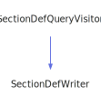

<h1>Scanner</h1>

<a href="https://github.com/CharlesCarley/MdDox">~</a>
<a href="indexpage.md#index">Index</a>
/
<a href="index.md#mddox">MdDox</a>
/
<a href="namespaceMdDox.md#">MdDox</a>
::
<a href="dir_19b9d1dd05713e515e11a6d5d9c80351.md#">Source/Xml</a>
::
<b>Scanner</b>
 
 

<h4>Derived From</h4>
<a href="classMdDox_1_1ScannerBase.md#scannerbase" class="icon-list-item">ScannerBase
</a>

 
 

<h2>Private Members</h2>
<a href="#_code" class="icon-list-item">_code
</a>

 
<a href="#_defaultstate" class="icon-list-item">_defaultState
</a>

 

<h2>Private Methods</h2>
<a href="#scanstring" class="icon-list-item">scanString
</a>

 
<a href="#scansymbol" class="icon-list-item">scanSymbol
</a>

 

<h2>Public Methods</h2>
<a href="#scanner" class="icon-list-item">Scanner
</a>

 
<a href="#getcode" class="icon-list-item">getCode
</a>

 
<a href="#scan" class="icon-list-item">scan
</a>

 

<h4>Defined in</h4>
<a href="https://github.com/CharlesCarley/MdDox/blob/master//Source/Xml/Scanner.h#L31" class="icon-list-item">Scanner.h
</a>

 

<h2>_code</h2>
<a href="namespaceMdDox_1_1Xml.md#codecache">CodeCache</a>
<b>_code</b>
 

<h4>Defined in</h4>
<a href="https://github.com/CharlesCarley/MdDox/blob/master//Source/Xml/Scanner.h#L33" class="icon-list-item">Scanner.h
</a>

 
 

<h2>_defaultState</h2>
bool
<b>_defaultState</b>
 

<h4>Defined in</h4>
<a href="https://github.com/CharlesCarley/MdDox/blob/master//Source/Xml/Scanner.h#L35" class="icon-list-item">Scanner.h
</a>

 
 

<h2>scanString</h2>
void
<b>scanString</b>
<i>(</i>

<a href="namespaceMdDox_1_1Xml.md#token">Token</a>
 &amp;
tok

<i>)</i>

<h4>Defined in</h4>
<a href="https://github.com/CharlesCarley/MdDox/blob/master//Source/Xml/Scanner.h#L39" class="icon-list-item">Scanner.h
</a>

 
<a href="https://github.com/CharlesCarley/MdDox/blob/master//Source/Xml/Scanner.cpp#L60" class="icon-list-item">Scanner.cpp
</a>

 
 

<h2>scanSymbol</h2>
void
<b>scanSymbol</b>
<i>(</i>

<a href="namespaceMdDox_1_1Xml.md#token">Token</a>
 &amp;
tok

<i>)</i>

<h4>Defined in</h4>
<a href="https://github.com/CharlesCarley/MdDox/blob/master//Source/Xml/Scanner.h#L37" class="icon-list-item">Scanner.h
</a>

 
<a href="https://github.com/CharlesCarley/MdDox/blob/master//Source/Xml/Scanner.cpp#L81" class="icon-list-item">Scanner.cpp
</a>

 
 

<h2>Scanner</h2>
<b>Scanner</b>
<i>(</i>
<i>)</i>

<h4>Defined in</h4>
<a href="https://github.com/CharlesCarley/MdDox/blob/master//Source/Xml/Scanner.h#L42" class="icon-list-item">Scanner.h
</a>

 
<a href="https://github.com/CharlesCarley/MdDox/blob/master//Source/Xml/Scanner.cpp#L28" class="icon-list-item">Scanner.cpp
</a>

 
 

<h2>getCode</h2>
void
<b>getCode</b>
<i>(</i>

<a href="namespaceMdDox.md#string">String</a>
 &amp;
dest

const size_t &amp;
idx

<i>)</i>

<h4>References</h4>
<a href="classMdDox_1_1ScannerBase.md#syntaxerror" class="icon-list-item">syntaxError
</a>

 

<h4>Defined in</h4>
<a href="https://github.com/CharlesCarley/MdDox/blob/master//Source/Xml/Scanner.h#L46" class="icon-list-item">Scanner.h
</a>

 
<a href="https://github.com/CharlesCarley/MdDox/blob/master//Source/Xml/Scanner.cpp#L52" class="icon-list-item">Scanner.cpp
</a>

 
 

<h2>scan</h2>
void
<b>scan</b>
<i>(</i>

<a href="namespaceMdDox_1_1Xml.md#token">Token</a>
 &amp;
tok

<i>)</i>

<h4>Details</h4>
Abstract method, derived scanners should implement their own scan loop. 
 
 
<ul>
<li><b>tok</b>
 - 
A reference to a temporary storage token. 
</li>
</ul>
 

<h4>References</h4>
<a href="classMdDox_1_1ScannerBase.md#_stream" class="icon-list-item">_stream
</a>

 
<a href="classMdDox_1_1ScannerBase.md#syntaxerror" class="icon-list-item">syntaxError
</a>

 
<a href="classMdDox_1_1TokenBase.md#clear" class="icon-list-item">clear
</a>

 
<a href="classMdDox_1_1TokenBase.md#setline" class="icon-list-item">setLine
</a>

 
<a href="classMdDox_1_1ScannerBase.md#_line" class="icon-list-item">_line
</a>

 
<a href="classMdDox_1_1ScannerBase.md#scanmultilinecomment" class="icon-list-item">scanMultiLineComment
</a>

 
<a href="classMdDox_1_1TokenBase.md#settype" class="icon-list-item">setType
</a>

 
<a href="namespaceMdDox_1_1Xml.md#tok_st_tag" class="icon-list-item">TOK_ST_TAG
</a>

 
<a href="namespaceMdDox_1_1Xml.md#tok_equals" class="icon-list-item">TOK_EQUALS
</a>

 
<a href="namespaceMdDox_1_1Xml.md#tok_en_tag" class="icon-list-item">TOK_EN_TAG
</a>

 
<a href="namespaceMdDox_1_1Xml.md#tok_slash" class="icon-list-item">TOK_SLASH
</a>

 
<a href="namespaceMdDox_1_1Xml.md#tok_question" class="icon-list-item">TOK_QUESTION
</a>

 
<a href="classMdDox_1_1ScannerBase.md#scanwhitespace" class="icon-list-item">scanWhiteSpace
</a>

 
<a href="classMdDox_1_1Char.md#tohexstring" class="icon-list-item">toHexString
</a>

 
<a href="namespaceMdDox.md#iswhitespace" class="icon-list-item">isWhiteSpace
</a>

 
<a href="classMdDox_1_1TokenBase.md#setindex" class="icon-list-item">setIndex
</a>

 
<a href="namespaceMdDox_1_1Xml.md#tok_text" class="icon-list-item">TOK_TEXT
</a>

 
<a href="namespaceMdDox_1_1Xml.md#tok_eof" class="icon-list-item">TOK_EOF
</a>

 

<h4>Defined in</h4>
<a href="https://github.com/CharlesCarley/MdDox/blob/master//Source/Xml/Scanner.h#L44" class="icon-list-item">Scanner.h
</a>

 
<a href="https://github.com/CharlesCarley/MdDox/blob/master//Source/Xml/Scanner.cpp#L109" class="icon-list-item">Scanner.cpp
</a>

 
 
 
<blockquote>
The following sources were used to generate this page.
 
<a href="../xml/classMdDox_1_1Xml_1_1Scanner.xml#L1" class="icon-list-item">classMdDox_1_1Xml_1_1Scanner.xml
</a>

 
<a href="../xml/compound.xsd#L1" class="icon-list-item">compound.xsd
</a>

</blockquote>

</body>
</html>
