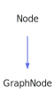

<a id="writer"></a>
<h1>Writer</h1>
<a id="classMdDox_1_1Xml_1_1Writer"></a>
<a href="https://github.com/CharlesCarley/MdDox">~</a>
<a href="indexpage.md#mddox">MdDox</a>
<span class="inline-text">/</span>
<a href="index.md#index">Index</a>
<span class="inline-text">/</span>
<a href="namespaceMdDox.md#mddox">MdDox</a>
<span class="inline-text">::</span>
<a href="namespaceMdDox_1_1Xml.md#xml">Xml</a>
<span class="inline-text">::</span>
<span class="bold-text"><b>Writer</b></span>
<br/>
<br/>
<span class="inline-text">Is a utility class that is used to write the xml text structure to the supplied stream from the supplied root node. </span>
<br/>
<a id="derived-by"></a>
<h4>Derived By</h4>
<div class="icon-link">
<a href="classMdDox_1_1GenApi_1_1Common.md#mddoxgenapicommon">MdDox::GenApi::Common</a>
</div>
<div class="icon-link">
<a href="classMdDox_1_1GenApi_1_1Object.md#mddoxgenapiobject">MdDox::GenApi::Object</a>
</div>
<br/>
<a id="private-members"></a>
<h2>Private Members</h2>
<span class="icon-list-item"><a href="#_indent" class="icon-list-item"><span class="icon-list-item">_indent</span>
</a>
</span>
<br/>
<span class="icon-list-item"><a href="#_out" class="icon-list-item"><span class="icon-list-item">_out</span>
</a>
</span>
<br/>
<span class="icon-list-item"><a href="#_root" class="icon-list-item"><span class="icon-list-item">_root</span>
</a>
</span>
<br/>
<span class="icon-list-item"><a href="#_writexml" class="icon-list-item"><span class="icon-list-item">_writeXml</span>
</a>
</span>
<br/>
<a id="private-methods"></a>
<h2>Private Methods</h2>
<span class="icon-list-item"><a href="#closetag" class="icon-list-item"><span class="icon-list-item">closeTag</span>
</a>
</span>
<br/>
<span class="icon-list-item"><a href="#inlinetag" class="icon-list-item"><span class="icon-list-item">inlineTag</span>
</a>
</span>
<br/>
<span class="icon-list-item"><a href="#opentag" class="icon-list-item"><span class="icon-list-item">openTag</span>
</a>
</span>
<br/>
<span class="icon-list-item"><a href="#writeattributes" class="icon-list-item"><span class="icon-list-item">writeAttributes</span>
</a>
</span>
<br/>
<span class="icon-list-item"><a href="#writetag" class="icon-list-item"><span class="icon-list-item">writeTag</span>
</a>
</span>
<br/>
<a id="public-methods"></a>
<h2>Public Methods</h2>
<span class="icon-list-item"><a href="#writer" class="icon-list-item"><span class="icon-list-item">Writer</span>
</a>
</span>
<br/>
<span class="icon-list-item"><a href="#~writer" class="icon-list-item"><span class="icon-list-item">~Writer</span>
</a>
</span>
<br/>
<span class="icon-list-item"><a href="#setindent" class="icon-list-item"><span class="icon-list-item">setIndent</span>
</a>
</span>
<br/>
<span class="icon-list-item"><a href="#setwritexml" class="icon-list-item"><span class="icon-list-item">setWriteXml</span>
</a>
</span>
<br/>
<span class="icon-list-item"><a href="#write" class="icon-list-item"><span class="icon-list-item">write</span>
</a>
</span>
<br/>
<a id="defined-in"></a>
<h4>Defined in</h4>
<span class="icon-list-item"><a href="https://github.com/CharlesCarley/MdDox/blob/master/Source/Xml/Writer.h#L35" class="icon-list-item"><span class="icon-list-item">Writer.h</span>
</a>
</span>
<a id="_indent"></a>
<h2>_indent</h2>
<span class="inline-text">int</span>
<span class="bold-text"><b>_indent</b></span>
<br/>
<a id="defined-in"></a>
<h4>Defined in</h4>
<span class="icon-list-item"><a href="https://github.com/CharlesCarley/MdDox/blob/master/Source/Xml/Writer.h#L39" class="icon-list-item"><span class="icon-list-item">Writer.h</span>
</a>
</span>
<br/>
<a id="_out"></a>
<h2>_out</h2>
<a href="namespaceMdDox.md#outputstringstream">OutputStringStream</a>
<span class="bold-text"><b>_out</b></span>
<br/>
<a id="defined-in"></a>
<h4>Defined in</h4>
<span class="icon-list-item"><a href="https://github.com/CharlesCarley/MdDox/blob/master/Source/Xml/Writer.h#L38" class="icon-list-item"><span class="icon-list-item">Writer.h</span>
</a>
</span>
<br/>
<a id="_root"></a>
<h2>_root</h2>
<a href="classMdDox_1_1Xml_1_1Node.md#node">Node</a>
<span class="inline-text"> *</span>
<span class="bold-text"><b>_root</b></span>
<br/>
<a id="defined-in"></a>
<h4>Defined in</h4>
<span class="icon-list-item"><a href="https://github.com/CharlesCarley/MdDox/blob/master/Source/Xml/Writer.h#L37" class="icon-list-item"><span class="icon-list-item">Writer.h</span>
</a>
</span>
<br/>
<a id="_writexml"></a>
<h2>_writeXml</h2>
<span class="inline-text">bool</span>
<span class="bold-text"><b>_writeXml</b></span>
<br/>
<a id="defined-in"></a>
<h4>Defined in</h4>
<span class="icon-list-item"><a href="https://github.com/CharlesCarley/MdDox/blob/master/Source/Xml/Writer.h#L40" class="icon-list-item"><span class="icon-list-item">Writer.h</span>
</a>
</span>
<br/>
<a id="closetag"></a>
<h2>closeTag</h2>
<span class="inline-text">void</span>
<span class="bold-text"><b>closeTag</b></span>
<span class="italic-text"><i>(</i></span>
<div class="paragraph">
<span class="paragraph"><a href="classMdDox_1_1Xml_1_1Node.md#node">Node</a>
<span class="inline-text"> *</span>
<span class="inline-text">tag</span>
</span>
</div>
<span class="italic-text"><i>)</i></span>
<a id="defined-in"></a>
<h4>Defined in</h4>
<span class="icon-list-item"><a href="https://github.com/CharlesCarley/MdDox/blob/master/Source/Xml/Writer.h#L44" class="icon-list-item"><span class="icon-list-item">Writer.h</span>
</a>
</span>
<br/>
<span class="icon-list-item"><a href="https://github.com/CharlesCarley/MdDox/blob/master/Source/Xml/Writer.cpp#L58" class="icon-list-item"><span class="icon-list-item">Writer.cpp</span>
</a>
</span>
<br/>
<a id="inlinetag"></a>
<h2>inlineTag</h2>
<span class="inline-text">void</span>
<span class="bold-text"><b>inlineTag</b></span>
<span class="italic-text"><i>(</i></span>
<div class="paragraph">
<span class="paragraph"><a href="classMdDox_1_1Xml_1_1Node.md#node">Node</a>
<span class="inline-text"> *</span>
<span class="inline-text">tag</span>
</span>
</div>
<span class="italic-text"><i>)</i></span>
<a id="defined-in"></a>
<h4>Defined in</h4>
<span class="icon-list-item"><a href="https://github.com/CharlesCarley/MdDox/blob/master/Source/Xml/Writer.h#L46" class="icon-list-item"><span class="icon-list-item">Writer.h</span>
</a>
</span>
<br/>
<span class="icon-list-item"><a href="https://github.com/CharlesCarley/MdDox/blob/master/Source/Xml/Writer.cpp#L68" class="icon-list-item"><span class="icon-list-item">Writer.cpp</span>
</a>
</span>
<br/>
<a id="opentag"></a>
<h2>openTag</h2>
<span class="inline-text">void</span>
<span class="bold-text"><b>openTag</b></span>
<span class="italic-text"><i>(</i></span>
<div class="paragraph">
<span class="paragraph"><a href="classMdDox_1_1Xml_1_1Node.md#node">Node</a>
<span class="inline-text"> *</span>
<span class="inline-text">tag</span>
</span>
</div>
<span class="italic-text"><i>)</i></span>
<a id="defined-in"></a>
<h4>Defined in</h4>
<span class="icon-list-item"><a href="https://github.com/CharlesCarley/MdDox/blob/master/Source/Xml/Writer.h#L42" class="icon-list-item"><span class="icon-list-item">Writer.h</span>
</a>
</span>
<br/>
<span class="icon-list-item"><a href="https://github.com/CharlesCarley/MdDox/blob/master/Source/Xml/Writer.cpp#L46" class="icon-list-item"><span class="icon-list-item">Writer.cpp</span>
</a>
</span>
<br/>
<a id="writeattributes"></a>
<h2>writeAttributes</h2>
<span class="inline-text">void</span>
<span class="bold-text"><b>writeAttributes</b></span>
<span class="italic-text"><i>(</i></span>
<div class="paragraph">
<span class="paragraph"><a href="classMdDox_1_1Xml_1_1Node.md#node">Node</a>
<span class="inline-text"> *</span>
<span class="inline-text">tag</span>
</span>
</div>
<span class="italic-text"><i>)</i></span>
<a id="defined-in"></a>
<h4>Defined in</h4>
<span class="icon-list-item"><a href="https://github.com/CharlesCarley/MdDox/blob/master/Source/Xml/Writer.h#L48" class="icon-list-item"><span class="icon-list-item">Writer.h</span>
</a>
</span>
<br/>
<span class="icon-list-item"><a href="https://github.com/CharlesCarley/MdDox/blob/master/Source/Xml/Writer.cpp#L81" class="icon-list-item"><span class="icon-list-item">Writer.cpp</span>
</a>
</span>
<br/>
<a id="writetag"></a>
<h2>writeTag</h2>
<span class="inline-text">void</span>
<span class="bold-text"><b>writeTag</b></span>
<span class="italic-text"><i>(</i></span>
<div class="paragraph">
<span class="paragraph"><a href="classMdDox_1_1Xml_1_1Node.md#node">Node</a>
<span class="inline-text"> *</span>
<span class="inline-text">tag</span>
</span>
</div>
<span class="italic-text"><i>)</i></span>
<a id="defined-in"></a>
<h4>Defined in</h4>
<span class="icon-list-item"><a href="https://github.com/CharlesCarley/MdDox/blob/master/Source/Xml/Writer.h#L50" class="icon-list-item"><span class="icon-list-item">Writer.h</span>
</a>
</span>
<br/>
<span class="icon-list-item"><a href="https://github.com/CharlesCarley/MdDox/blob/master/Source/Xml/Writer.cpp#L97" class="icon-list-item"><span class="icon-list-item">Writer.cpp</span>
</a>
</span>
<br/>
<a id="writer"></a>
<h2>Writer</h2>
<span class="bold-text"><b>Writer</b></span>
<span class="italic-text"><i>(</i></span>
<div class="paragraph">
<span class="paragraph"><a href="classMdDox_1_1Xml_1_1Node.md#node">Node</a>
<span class="inline-text"> *</span>
<span class="inline-text">root</span>
</span>
</div>
<span class="italic-text"><i>)</i></span>
<a id="details"></a>
<h4>Details</h4>
<span class="inline-text">Constructs a </span>
<a href="classMdDox_1_1Xml_1_1Writer.md#writer">Writer</a>
<span class="inline-text"> with a node. </span>
<br/>
<br/>
<ul>
<li><span class="bold-text"><b>root</b></span>
<span class="inline-text"> - </span>
<span class="inline-text">The node to print.</span>
</li>
</ul>
<span class="inline-text">
When write is invoked, the text based structure will be logged to the supplied stream. </span>
<br/>
<a id="defined-in"></a>
<h4>Defined in</h4>
<span class="icon-list-item"><a href="https://github.com/CharlesCarley/MdDox/blob/master/Source/Xml/Writer.h#L60" class="icon-list-item"><span class="icon-list-item">Writer.h</span>
</a>
</span>
<br/>
<span class="icon-list-item"><a href="https://github.com/CharlesCarley/MdDox/blob/master/Source/Xml/Writer.cpp#L31" class="icon-list-item"><span class="icon-list-item">Writer.cpp</span>
</a>
</span>
<br/>
<a id="~writer"></a>
<h2>~Writer</h2>
<span class="bold-text"><b>~Writer</b></span>
<span class="italic-text"><i>(</i></span>
<span class="italic-text"><i>)</i></span>
<a id="defined-in"></a>
<h4>Defined in</h4>
<span class="icon-list-item"><a href="https://github.com/CharlesCarley/MdDox/blob/master/Source/Xml/Writer.h#L62" class="icon-list-item"><span class="icon-list-item">Writer.h</span>
</a>
</span>
<br/>
<a id="setindent"></a>
<h2>setIndent</h2>
<span class="inline-text">void</span>
<span class="bold-text"><b>setIndent</b></span>
<span class="italic-text"><i>(</i></span>
<div class="paragraph">
<span class="paragraph"><span class="inline-text">int</span>
<span class="inline-text">indent</span>
</span>
</div>
<span class="italic-text"><i>)</i></span>
<a id="details"></a>
<h4>Details</h4>
<span class="inline-text">Sets the indentation level per depth. </span>
<br/>
<br/>
<br/>
<ul>
<li><span class="bold-text"><b>indent</b></span>
<span class="inline-text"> - </span>
<span class="inline-text">The number of spaces per level. </span>
</li>
</ul>
<br/>
<a id="references"></a>
<h4>References</h4>
<div class="paragraph">
<span class="paragraph"><a href="namespaceMdDox_1_1WriteUtils.md#indent">indent</a>
</span>
</div>
<a id="defined-in"></a>
<h4>Defined in</h4>
<span class="icon-list-item"><a href="https://github.com/CharlesCarley/MdDox/blob/master/Source/Xml/Writer.h#L68" class="icon-list-item"><span class="icon-list-item">Writer.h</span>
</a>
</span>
<br/>
<span class="icon-list-item"><a href="https://github.com/CharlesCarley/MdDox/blob/master/Source/Xml/Writer.cpp#L36" class="icon-list-item"><span class="icon-list-item">Writer.cpp</span>
</a>
</span>
<br/>
<a id="setwritexml"></a>
<h2>setWriteXml</h2>
<span class="inline-text">void</span>
<span class="bold-text"><b>setWriteXml</b></span>
<span class="italic-text"><i>(</i></span>
<div class="paragraph">
<span class="paragraph"><span class="inline-text">bool</span>
<span class="inline-text">value</span>
</span>
</div>
<span class="italic-text"><i>)</i></span>
<a id="details"></a>
<h4>Details</h4>
<span class="inline-text">Enables the xml header. </span>
<br/>
<br/>
<ul>
<li><span class="bold-text"><b>value</b></span>
<span class="inline-text"> - </span>
<span class="inline-text">If this is true the xml header will be written to the stream</span>
</li>
</ul>

```xml
<?xml version="1.0"?>
```
<br/>
<a id="defined-in"></a>
<h4>Defined in</h4>
<span class="icon-list-item"><a href="https://github.com/CharlesCarley/MdDox/blob/master/Source/Xml/Writer.h#L79" class="icon-list-item"><span class="icon-list-item">Writer.h</span>
</a>
</span>
<br/>
<span class="icon-list-item"><a href="https://github.com/CharlesCarley/MdDox/blob/master/Source/Xml/Writer.cpp#L41" class="icon-list-item"><span class="icon-list-item">Writer.cpp</span>
</a>
</span>
<br/>
<a id="write"></a>
<h2>write</h2>
<span class="inline-text">void</span>
<span class="bold-text"><b>write</b></span>
<span class="italic-text"><i>(</i></span>
<div class="paragraph">
<span class="paragraph"><a href="namespaceMdDox.md#ostream">OStream</a>
<span class="inline-text"> &amp;</span>
<span class="inline-text">output</span>
</span>
</div>
<span class="italic-text"><i>)</i></span>
<a id="details"></a>
<h4>Details</h4>
<span class="inline-text">Writes the contents of the node to the supplied output stream. </span>
<br/>
<br/>
<ul>
<li><span class="bold-text"><b>output</b></span>
<span class="inline-text"> - </span>
<span class="inline-text">The output stream to use. </span>
</li>
</ul>
<br/>
<a id="defined-in"></a>
<h4>Defined in</h4>
<span class="icon-list-item"><a href="https://github.com/CharlesCarley/MdDox/blob/master/Source/Xml/Writer.h#L86" class="icon-list-item"><span class="icon-list-item">Writer.h</span>
</a>
</span>
<br/>
<span class="icon-list-item"><a href="https://github.com/CharlesCarley/MdDox/blob/master/Source/Xml/Writer.cpp#L115" class="icon-list-item"><span class="icon-list-item">Writer.cpp</span>
</a>
</span>
<br/>
</div>
</div>
</body>
</html>
