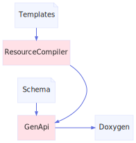

<h1>Tools</h1>

<a href="https://github.com/CharlesCarley/MdDox#~">~</a>
<a href="index.md#index">MdDox</a>
/
<b>Tools</b>
 
 

<h2>Contents</h2>
<ul>
<li><b>Doxygen</b>
 is a generated scaffolding library.
</li>
<li><b>GenApi</b>
 is the generator that writes the scaffolding library.
</li>
<li><b>ResourceCompiler</b>
 is a resource compiler for the generator.
</li>
</ul>
 

<h2>Directories</h2>

<a href="dir_b7487e7b43f0278857c63f4e9ad683a3.md#tools-doxygen">Doxygen</a>

<a href="dir_f29546df2d60a62028851d3354c1d20f.md#tools-genapi">GenApi</a>

<a href="dir_ad64d74126afa4ea39d3914a0c472a63.md#tools-resourcecompiler">ResourceCompiler</a>

</body>
</html>
